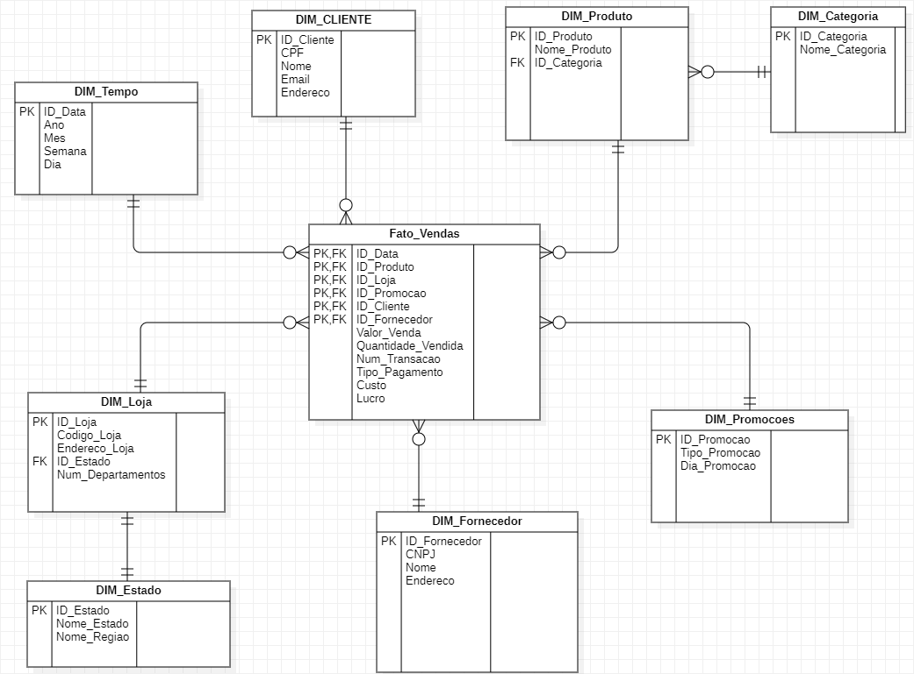

# Modelagem Dimensional
## Modelagem de Negócio

A rede de varejo UpZ possui diversas lojas em todo país, onde as vendas diárias acontecem para vários produtos. Os gerentes estão enfrentando problemas durante a tomada de decisões devido à falta de disponibilidade de dados integrados e por isso eles nos pediram para projetar um sistema que pudesse ajudá-los rapidamente na tomada de decisões e fornecer retorno sobre o investimento (ROI).

A UpZ possui 100 lojas em 5 estados diferentes. Cada loja possui diversos departamentos, tais como: mercearia, padaria, alimentos congelados, carnes, laticínios, bebidas, produtos de beleza, entre outros. No total são quase 60 mil produtos individuais.

Todas as vendas são registradas nos caixas quando o pagamento é coletado, mas alguns clientes fazem os pedidos pela internet e efetuam o pagamento no momento da entrega dos produtos.

Um delicado processo de logística, desde o pedido nos fornecedores, passando pelo estoque, etiquetagem, movimento para os pontos de venda, armazenamento e descarte no caso de produtos perecíveis, deve funcionar sem falhas, sob o risco de gerar prejuízos para a empresa.

Os gerentes definiram que o nível mínimo de informação que eles gostariam de obter é o nível das transações diárias, para que eles possam tomar decisões para os dias seguintes, principalmente para os dias de promoções, que ocorrem quartas, sextas e sábados e na primeira segunda-feira de cada mês.

Eles precisam obter total de vendas e a quantidade vendida por produto, por dia e por loja. O custo e o lucro diário também são informações relevantes. Eles querem ainda poder agregar os dados por diferentes períodos, como semanas, meses, trimestres e anos e comparar as vendas dos produtos quando houver e quando não houver promoção. Aqui um exemplo de um dos relatórios que eles gostariam de poder emitir:

Data | Nome Promoção | Total de Vendas
--- | --- | ---
06/03/2023 | Sem promoção | R$ 21.400,89
13/03/2023 | Promoção Especial 1 | R$ 15.876,23

Os gerentes não têm certeza sobre quais filtros deveriam ser usados nos relatórios e pediram sua ajuda com algumas propostas.

## Solução

<b>Referência:</b> conferir o arquivo `MD_Lab-2.mdj`, criado no StarUML.
