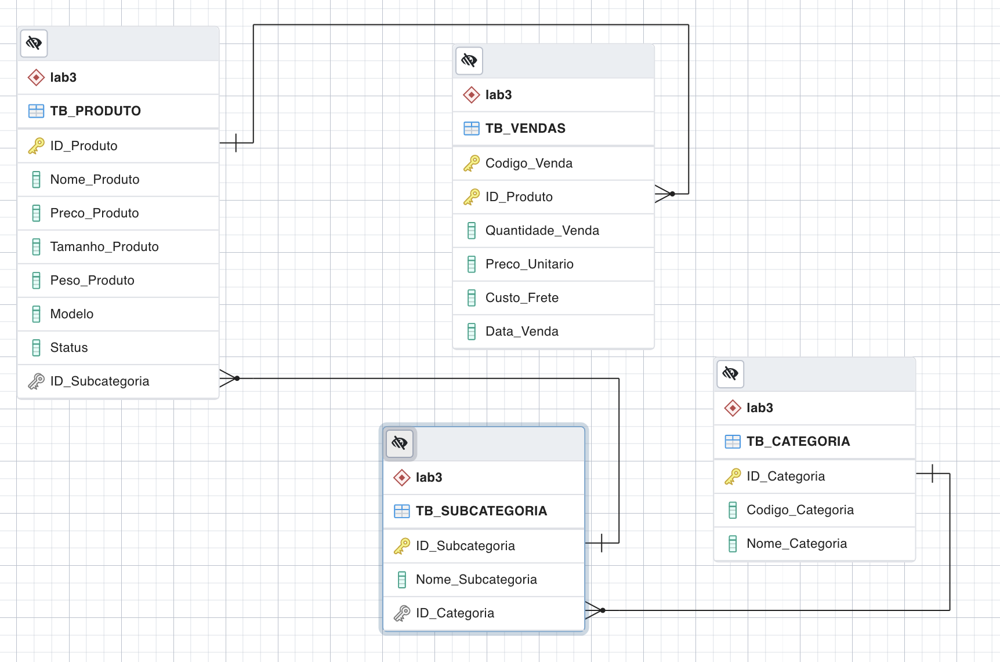

# Linguagem SQL para Engenheiro de Dados
## Criação do container Docker
Para criarmos o container com o Sistema de Gerenciamento de Banco de Dados (SGBD) PostgreSQL, será necessário executar o comando abaixo:

```bash
docker run --name dbdsa -p 5432:5432 --network=bridge -e POSTGRES_USER=dbadmin -e POSTGRES_PASSWORD=dbadmin123 -e POSTGRES_DB=postgresDB -d postgres
```

## Criação do container PGAdmin
Para acessarmos o SGBD através do PGAdmin, será necessário executar o comando abaixo:

```bash
docker run --name pgadmin -p 8080:8080 --network=bridge -e PGADMIN_DEFAULT_EMAIL=root@root.com PGADMIN_DEFAULT_PASSWORD=root -d dpage/pgadmin4
```

## Modelo Relacional Final


## Dados para Ingestão (primeiras 4 linhas para ilustração)
### TB_CATEGORIA 
ID_Categoria | Codigo_Categoria | Nome_Categoria
--- | --- | ---
1 | 1001 | Bikes
2 | 1002 | Components
3 | 1003 | Clothing

### TB_PRODUTO
ID_Produto | Nome_Produto | Preco_Produto | Tamanho_Produto | Peso_Produto | Modelo | Status | ID_Subcategoria
--- | --- | --- | --- | --- | --- | --- | ---
453 | Men's Sports Shorts, M | 59.99 | M | | Men's Sports Shorts | | 22
454 | Men's Sports Shorts, L | 59.99 | L | | Men's Sports Shorts | | 22
455 | Men's Sports Shorts, XL | 59.99 | XL | | Men's Sports Shorts | | 22

### TB_SUBCATEGORIA
ID_Subcategoria | Nome_Subcategoria | ID_Categoria
--- | --- | ---
1 | Mountain Bikes | 1
2 | Road Bikes | 1
3 | Touring Bikes | 1

### TB_VENDAS
Codigo_Venda | ID_Produto | Quantidade_Venda | Preco_Unitario | Custo_Frete | Data_Venda
--- | --- | --- | --- | --- | ---
SO51900 | 528 | 1 | 4.99 | 0.1248 | 2013-01-28 0:00
SO51948 | 528 | 1 | 4.99 | 0.1248 | 2013-01-29 0:00
SO52043 | 528 | 1 | 4.99 | 0.1248 | 2013-01-31 0:00

## Scripts SQL
- [Criação das tabelas (sem restrições lógicas/relacionais)](script_1.sql)
- [Criação das restrições](script_2.sql)
- [Exemplos de DQL](script_3.sql)
- [Exemplos de DML](script_4.sql)
- [Script de auditoria](script_5.sql)
