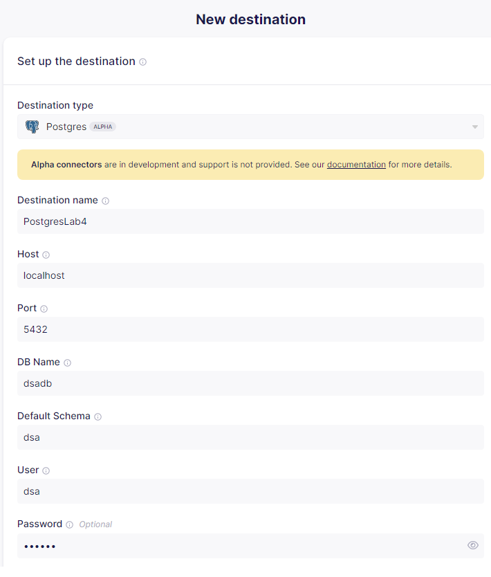
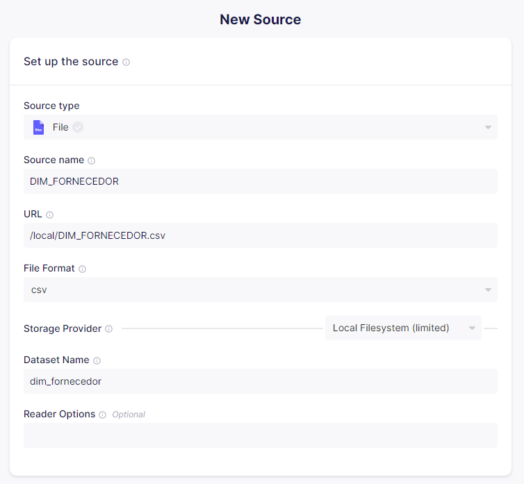
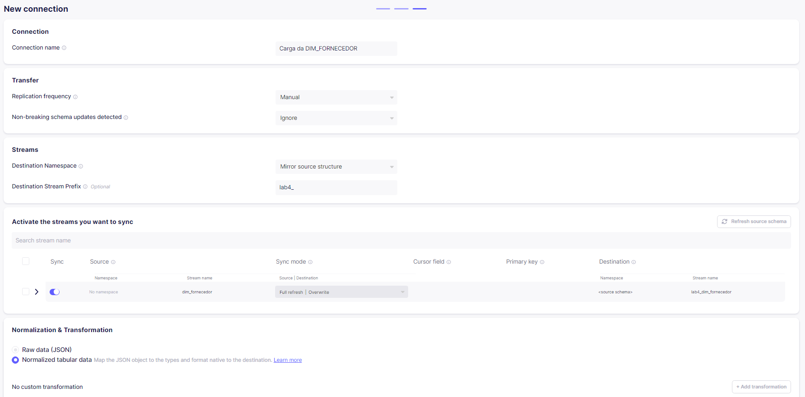

# Capacity Planning de Data Warehouse com Airbyte
Vamos estimar o tamanho de um banco de dados (calculando aritmeticamente) e comparar com o tamanho real (utilizando Airbyte).

## Tamanho estimado
| Descrição | Estimativa |
| --- | --- |
| 1. Estimar o tamanho de uma linha de tabela FATO. | 60 bytes |
| 2. Determinar a granularidade de cada dimensão. | DIM_FORNECEDOR = 37 <br> DIM_PRODUTO = 403 |
| 3. Multiplicar os itens 1 e 2. | 60 x (37 x 403) = 894.660 bytes |
| 4. Determinar se a tabela FATO é densa ou esparsa. | DENSA (existe, no geral, valores em todas as colunas) |
| 5. Fator de ajuste para metadados e/ou outros dados de controle do SGBD, Ferramenta ETL etc. | 8 |
| 6. Estimativa do tamanho do banco de dados. | 894.600 x 8 = 7.157.280 bytes |
| **Estimativa final:** | Aproximadamente 7 MB |

## Tamanho real via Airbyte
### Instalando o Airbyte
```bash
$ git clone https://github.com/airbytehq/airbyte.git
$ cd airbyte
$ docker compose up
```

### Entrando no Airbyte
Pelo enderenço `localhost:8000`, utilize login `airbyte` e senha `password` para acessar a interface do Airbyte.

### Criando Container para o Data Warehouse
Execute o comando abaixo para criar o container com o Postgres:

```bash
$ docker run --name dbdsa-lab4 -p 5432:5432 -e POSTGRES_USER=dsa -e POSTGRES_PASSWORD=dsa123 -e POSTGRES_DB=dsadb -d postgres
```

### Verificando tamanho do banco antes da carga ETL

Input:
```sql
SELECT pg_size_pretty(pg_database_size('dsadb'));
```
Output:
| pg_size_pretty |
| --- |
| 7453 kB |

### Tamanho de todos os bancos do SGBD (por padrão)
Input:
```sql
SELECT pg_database.datname as "database_name", pg_size_pretty(pg_database_size(pg_database.datname)) AS size_in_mb FROM pg_database ORDER by size_in_mb DESC;
```
Output:
| database_name | size_in_mb |
| --- | --- |
| template 1 | 7525 kB |
| postgres | 7453 kB |
| dsadb | 7453 kB |
| template0 | 7297 kB |

### Criando um destino no Airbyte
Preencha conforme abaixo:



### Criando as fontes no Airbyte
Antes de preencher, é necessário fazer com que os arquivos `.csv` sejam acessíveis para o Airbyte. Para isso, vamos executar os seguintes comandos:

```bash
$ sudo cp DIM_FORNECEDOR.csv /tmp/airbyte_local
$ sudo cp DIM_PRODUTO.csv /tmp/airbyte_local
$ sudo cp FATO_VENDAS.csv /tmp/airbyte_local

$ docker cp /tmp/airbyte_local airbyte-server:/tmp/airbyte_local
```

Preencha conforme abaixo, alternando com base em cada um dos três arquivos `.csv`:



### Criando a conexão
Será necessária a criação de uma conexão para cada fonte criada.

Preencha conforme abaixo:



### Tamanho do banco depois da carga ETL
| pg_size_pretty |
| --- |
| 15 MB |

Ou seja, a nossa estimativa estava correta, visto que se subtrairmos os **7.4 MB** (arquivos do SGBD) dos **15 MB** (tamanho final do banco), o volume de dados corresponde a aproximadamente **7.6 MB** (estimamos 7 MB).