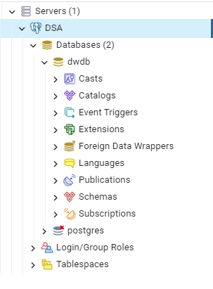
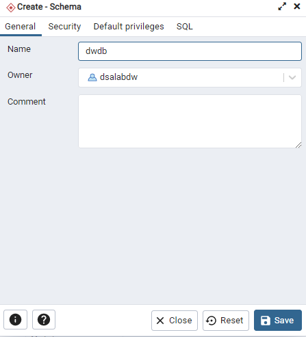
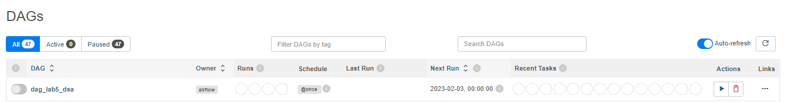

# Automação do Processo ETL no Data Warehouse com Apache Airflow

Neste Lab, o objetivo é construir um Processo ETL para carregar dados no Data Warehouse, usando o Apache Airflow.

O Apache Airflow é, de fato, uma ferramenta de automação de tarefas e isso é o que iremos construir. Um processo automatizado que extrai dados da fonte, aplica as transformações necessárias e carrega o resultado no banco de dados do DW. 

Vamos também explorar as funcionalidades de automação e agendamento oferecidas pelo Apache Airflow. Vamos ainda implementar toda a infraestrutura em uma rede de containers Docker e simular a ocorrência de problemas a fim de praticar troubleshooting (resolução de problemas).

A visão geral do que faremos neste lab consta na imagem abaixo:


- **Infraestrutura:** Docker
- **SGBD:** PostgreSQL (container Docker)
- **Visualização/Administração do Banco:** pgAdmin (container Docker)
- **Orquestração:** Apache Airflow (container Docker)
- **Controle de Ambiente Virtual:** Anaconda

## Criando o Ambiente Virtual

Para a criação do Ambiente Virtual, no qual isolaremos as instalações de pacotes e dependências, basta executar os comandos abaixo:

```
conda create --name dsa_dw_lab-5
conda activate dsa_dw_lab-5
```

## Criando os containers

Para a criação dos containers Docker, basta executar `docker-compose up -d` na mesma pasta em que se localiza o arquivo `docker-compose.yaml`

## Acessando e Configurando o SGBD

### Acesso

Com os containers em execução, para acessar o SGBD via pgAdmin, basta seguir os passos ilustrados abaixo (conforme definição no `docker-compose.yaml`):

Primeiramente, acesse a interface através do link `localhost:1000` (a porta padrão é a 8080, mas como usaremos o Airflow, foi necessário a atribuição de uma porta diferente).

- **Login:** `admin@admin.com`
- **Password:** `root`


*senha dsalabdw123, conforme definição no arquivo* 



### Criação do Schema

Com o acesso estabelecido, siga os passos ilustrados abaixo para criação do Schema:





## Inicialização do Airflow

Certifique-se de que seu terminal está na pasta `/airflow` e execute os comandos abaixo:

```
docker-compose up airflow-init
docker-compose up -d
```

Primeiramente, acesse a interface através do link `localhost:8080`.

- **Username:** `airflow`
- **Password:** `airflow`

## Estabelecendo o conector Postgres no Airflow

Com a interface do Airflow aberta, siga os passos ilustrados abaixo:


## Retrato do Banco de Dados antes da DAG Run

Como podemos conferir na imagem abaixo, atualmente não há tabelas (nem dados, portanto) no Schema:


## Executando a DAG

Os scripts devem ser inseridos na pasta `/airflow/dags`, e lá as DAGs serão listadas de acordo com o `dag_id` definido no código (no nosso caso: `dag_lab5_dsa`), conforme código e imagem abaixo:

```
dag_lab5_dsa = DAG(dag_id = "dag_lab5_dsa",
                   default_args = args,
                   # schedule_interval='0 0 * * *',
                   schedule_interval = '@once',  
                   dagrun_timeout = timedelta(minutes = 60),
                   description = 'Job ETL de Carga no DW com Airflow',
                   start_date = airflow.utils.dates.days_ago(1)
)
```



Clicando na habilitação da DAG, ela automaticamente executa, conforme abaixo:


## Retrato do Banco de Dados antes da DAG Run

Após a DAG ter sido executada, a tabela é criada dentro do Schema e os dados são inseridos:


