# Apache Airflow para Extração, Transformação e Carga de Dados (ETL) em Tempo Real

Neste Lab o objetivo é construir um processo ETL para carregar dados no Data Warehouse, usando o Apache Airflow, em tempo real.

O job no Airflow ficará agendado para um horário determinado do dia e ficará verificando uma pasta com a fonte de dados (arquivos CSV). Quando a pasta receber novos arquivos CSV, nosso processo ETL vai ler os arquivos, limpar, processar, organizar e carregar no DW, que será criado com PostgreSQL.

Vamos definir um modelo Star Schema para o DW, criar o modelo no banco de dados, definir as fontes de dados, criar o processo ETL e então criar o job no Airflow, automatizando todo o processo.


Considere as perguntas abaixo de um gestor da área de Logística de uma rede de varejo:

- Quantas entregas são realizadas por mês?
- Do total de entregas por mês, quantas ocorrem no prazo?
- Qual o percentual de entregas no prazo e com atraso?
- Quais meses tiveram maiornúmero de entregas no prazo?
- Um determinado cliente recebeu mais entregas no prazo ou com atraso?

Essas são tipicamente perguntas de negócio para as quais os gestores buscam respostas. E para responder essas e outras perguntas vamos construir um DW. 

## Modelagem do DW

### Definição do Problema de Negócio

A empresa JoiaRara Corp. atua na área de varejo comercializando diversos produtos em suas muitas lojas em todo Brasil e gostaria de implementar um DW para suportar as decisões de negócio.

Especificamente, a empresa deseja focar na área de logística (Data Mart) que tem apresentado alto custo nas entregas dos produtos.

A JoiaRara Corp. trabalha com diferentes transportadoras, que coletam os produtos em um dos vários depósitos da empresa. Uma vez coletado o produto, a transportadora realiza entrega para o cliente.

O valor de frete de cada entrega varia de acordo com o produto e a localidade de entrega, e a JoiaRara Corp. precisa compreender como o custo com o frete pode ser reduzido.

A JoiaRara Corp. também precisa comparar o tempo gasto por cada transportadora para entrega, medindo a diferença entre a data de coleta do produto no depósito e a data de entrega ao cliente. 

O cliente paga o frete em compras acima de R$100. Independente disso, cada transportadora recebe o pagamento pelo seu serviço.

A empresa tem o cadastro dos clientes, das transportadoras e dos depósitos.

Relatórios financeiros, de entregas, de custo de frete e da performance das transportadoras (tempo de entrega) serão necessários.

### Modelagem Conceitual Inicial

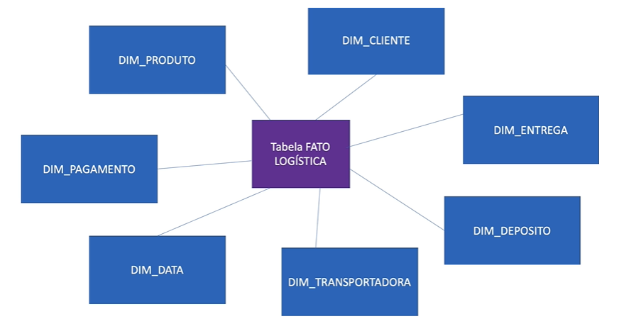

## Construção do DW

### Configuração Inicial

Para referências gerais sobre como operar a configuração incial, confira o [Lab 5 - Automação do Processo ETL no Data Warehouse com Apache Airflow](https://github.com/jeantozzi/engenharia-de-dados_DSA/tree/main/Design%20e%20Implementa%C3%A7%C3%A3o%20de%20Data%20Warehouses/Lab%205%20-%20Automa%C3%A7%C3%A3o%20do%20Processo%20ETL%20no%20Data%20Warehouse%20com%20Apache%20Airflow), aplicando os procedimentos ao laboratório atual.

Dentro do pgAdmin, criar os seguintes itens:
- Banco de Dados: `dwlab6` (criado automaticamente no `docker-compose.yaml`)
- Schema: `lab6`

### Modelagem Física e Criação da Estrutura

Executando os comandos presentes no arquivo [cria_tabelas.sql](https://github.com/jeantozzi/engenharia-de-dados_DSA/blob/main/Design%20e%20Implementa%C3%A7%C3%A3o%20de%20Data%20Warehouses/Lab%206%20-%20Apache%20Airflow%20para%20Extra%C3%A7%C3%A3o%2C%20Transforma%C3%A7%C3%A3o%20e%20Carga%20de%20Dados%20(ETL)%20em%20Tempo%20Real/cria_tabelas.sql), criaremos no Postgres a estrutura que reflete a Modelagem Física abaixo:

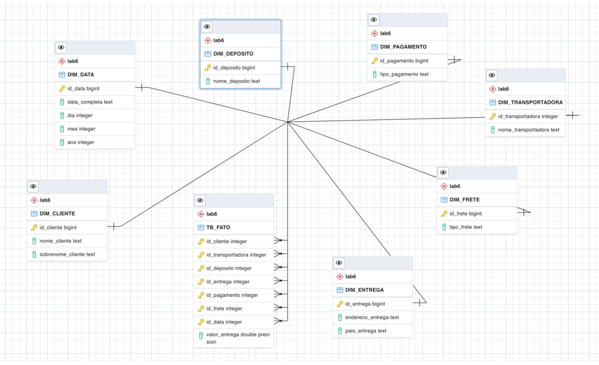

## Airflow

### Criação da Conexão para o DW

Para realizar a atividade, precisamos que exista uma conexão do Airflow para o Postgres com o nome `Lab6DW`, assim não haverá erros no script em relação a isto.

### Execução da DAG

Na UI do Airflow (no nosso caso, no `localhost:8080`), você pode localizar e acionar a DAG `lab6_final`, como ilustrado na imagem a seguir:

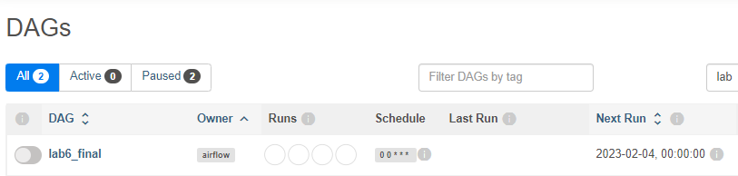

O upstream abaixo ilustra qual ordem dos processos:

```python
tarefa_trunca_tb_fato >> tarefa_trunca_dim_cliente >> tarefa_trunca_dim_pagamento >> tarefa_trunca_dim_frete >> tarefa_trunca_dim_data >> tarefa_trunca_dim_transportadora >> tarefa_trunca_dim_entrega >> tarefa_trunca_dim_deposito >> tarefa_carrega_dados_clientes >> tarefa_carrega_dados_transportadora >> tarefa_carrega_dados_deposito >> tarefa_carrega_dados_entrega >> tarefa_carrega_dados_frete >> tarefa_carrega_dados_pagamento >> tarefa_carrega_dados_data >> tarefa_carrega_dados_fatos

```

Ou seja:

- Todas as tabelas são truncadas (limpas);
- As tabelas são carregadas de acordo com os arquivos dados;
- A ordem do carregamento respeita as restrições da modelagem;

Temos o output gráfico abaixo ilustrando a ordem e o tempo de execução de cada um dos processos:

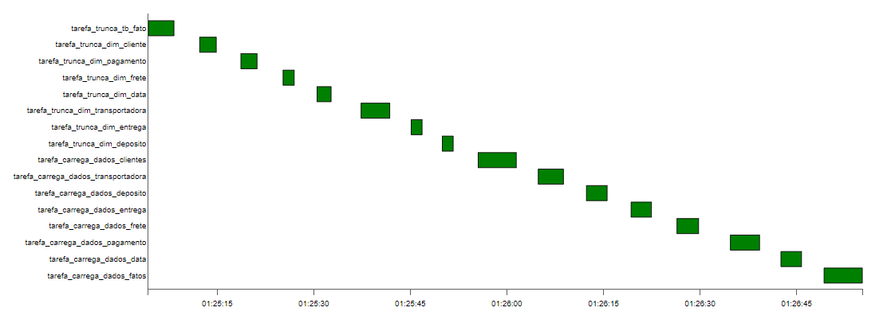

Como resultado, temos as tabelas populadas de acordo com arquivos da pasta `dags/dados`.

### dim_cliente

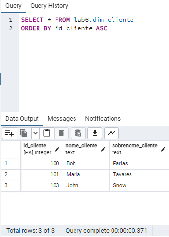

### dim_transportadora

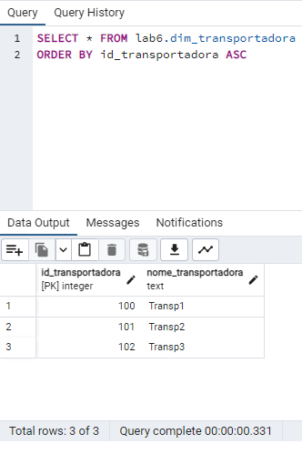

### dim_deposito

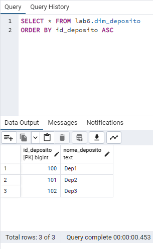

### dim_entrega

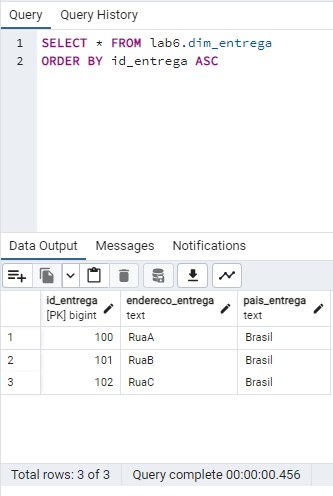

### dim_frete

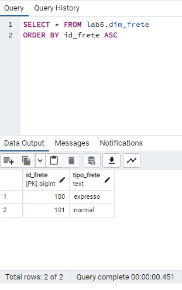

### dim_pagamento

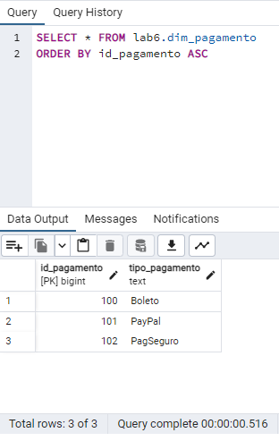

### dim_data

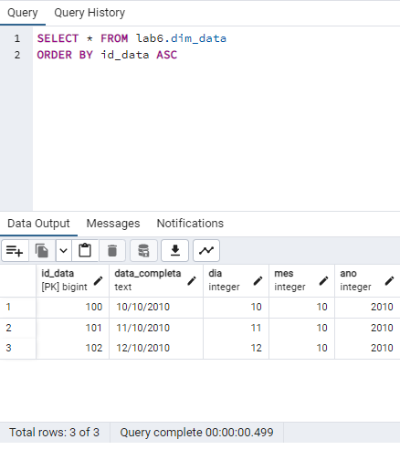

### tb_fato

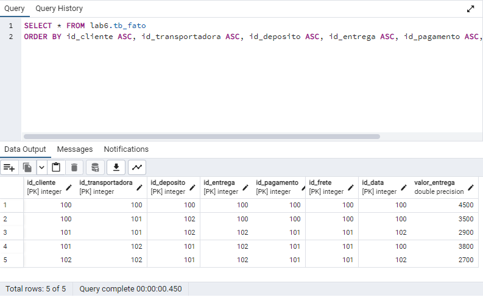
