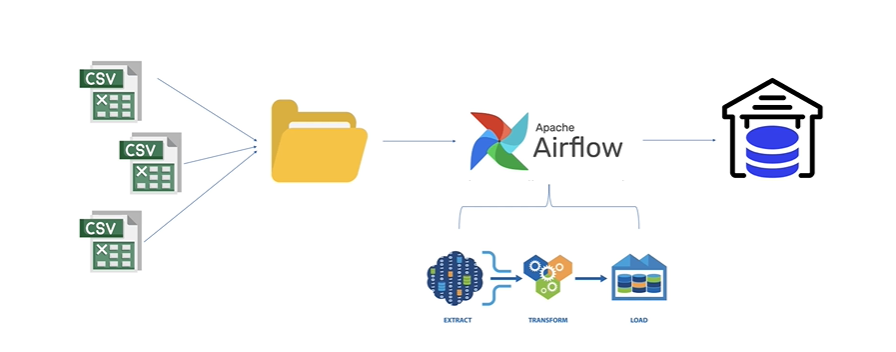

# Apache Airflow para Extração, Transformação e Carga de Dados (ETL) em Tempo Real

Neste Lab o objetivo é construir um processo ETL para carregar dados no Data Warehouse, usando o Apache Airflow, em tempo real.

O job no Airflow ficará agendado para um horário determinado do dia e ficará verificando uma pasta com a fonte de dados (arquivos CSV). Quando a pasta receber novos arquivos CSV, nosso processo ETL vai ler os arquivos, limpar, processar, organizar e carregar no DW, que será criado com PostgreSQL.

Vamos definir um modelo Star Schema para o DW, criar o modelo no banco de dados, definir as fontes de dados, criar o processo ETL e então criar o job no Airflow, automatizando todo o processo.

Considere as perguntas abaixo de um gestor da área de Logística de uma rede de varejo:

- Quantas entregas são realizadas por mês?
- Do total de entregas por mês, quantas ocorrem no prazo?
- Qual o percentual de entregas no prazo e com atraso?
- Quais meses tiveram maiornúmero de entregas no prazo?
- Um determinado cliente recebeu mais entregas no prazo ou com atraso?

Essas são tipicamente perguntas de negócio para as quais os gestores buscam respostas. E para responder essas e outras perguntas vamos construir um DW. 

Ao final, vamos criar queries SQL para responder algumas perguntas de negócio (como as acima).

## Modelagem do DW

### Definição do Problema de Negócio

A empresa JoiaRara Corp. atua na área de varejo comercializando diversos produtos em suas muitas lojas em todo Brasil e gostaria de implementar um DW para suportar as decisões de negócio.

Especificamente, a empresa deseja focar na área de logística (Data Mart) que tem apresentado alto custo nas entregas dos produtos.

A JoiaRara Corp. trabalha com diferentes transportadoras, que coletam os produtos em um dos vários depósitos da empresa. Uma vez coletado o produto, a transportadora realiza entrega para o cliente.

O valor de frete de cada entrega varia de acordo com o produto e a localidade de entrega, e a JoiaRara Corp. precisa compreender como o custo com o frete pode ser reduzido.

A JoiaRara Corp. também precisa comparar o tempo gasto por cada transportadora para entrega, medindo a diferença entre a data de coleta do produto no depósito e a data de entrega ao cliente. 

O cliente paga o frete em compras acima de R$100. Independente disso, cada transportadora recebe o pagamento pelo seu serviço.

A empresa tem o cadastro dos clientes, das transportadoras e dos depósitos.

Relatórios financeiros, de entregas, de custo de frete e da performance das transportadoras (tempo de entrega) serão necessários.