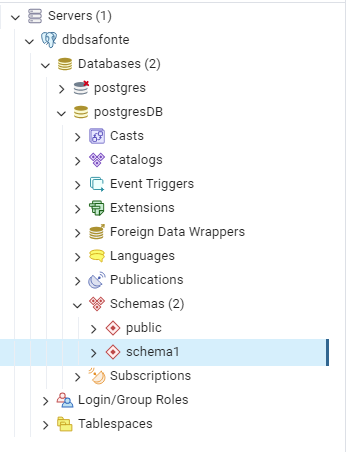
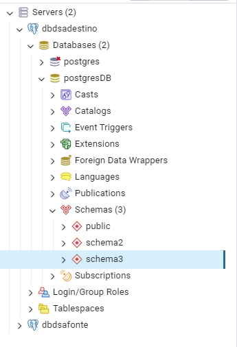
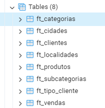
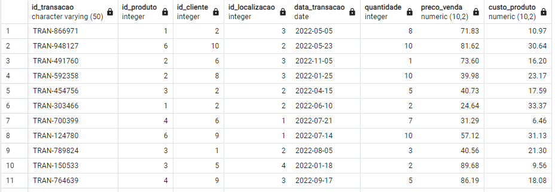
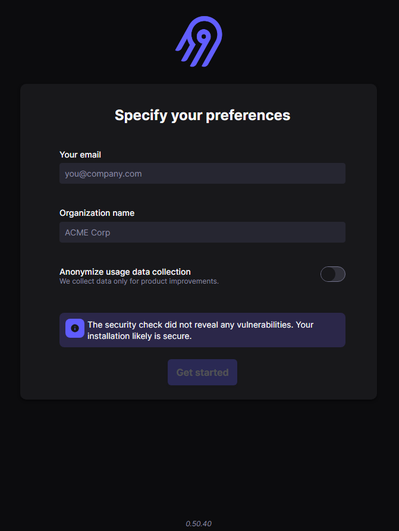
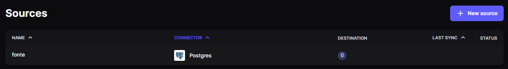
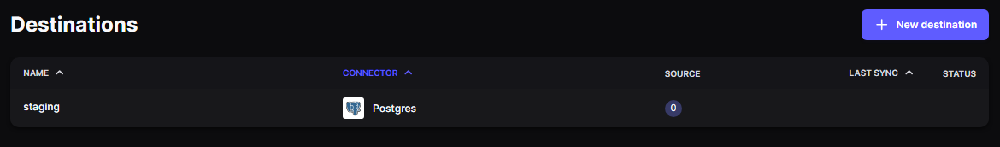
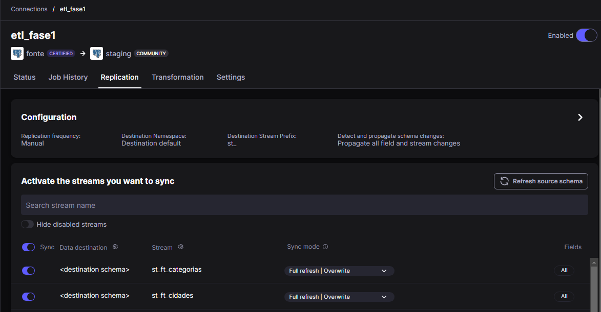
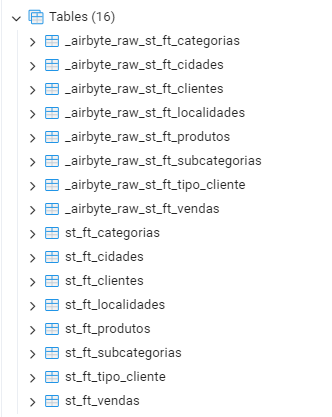
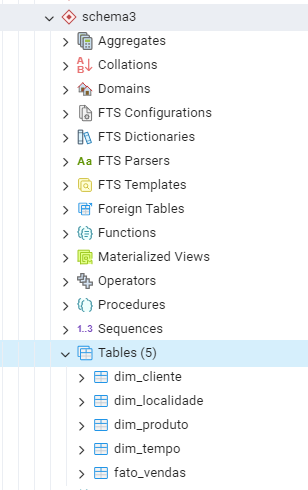

# Local Datawarehouse com Docker

## Sumário
- [Apresentação geral do projeto](#apresentação-geral-do-projeto)
- [Definição do problema de negócio](#definição-do-problema-de-negócio)
- [Esboço de modelagem](#esboço-de-modelagem)
    - [Modelagem dimensional](#modelagem-dimensional)
    - [Modelagem física](#modelagem-física)
- [Arquitetura do ETL](#arquitetura-do-etl)
- [Criação dos containers de banco de dados](#criação-dos-containers-de-banco-de-dados)
- [Padrão de nomenclatura](#padrão-de-nomenclatura)
- [Criação e carga das tabelas no container de Fonte de Dados](#criação-e-carga-das-tabelas-no-container-de-fonte-de-dados)
    - [Tabela de categorias](#tabela-de-categorias)
    - [Tabela de subcategorias](#tabela-de-subcategorias)
    - [Tabela de produtos](#tabela-de-produtos)
    - [Tabela de cidades](#tabela-de-cidades)
    - [Tabela de localidades](#tabela-de-localidades)
    - [Tabela de tipos de cliente](#tabela-de-tipos-de-cliente)
    - [Tabela de clientes](#tabela-de-clientes)
    - [Tabela de vendas](#tabela-de-vendas)
    - [Resultado tabelas da Fonte de Dados](#resultado-tabelas-da-fonte-de-dados)
- [Instalação do Airbyte para o processo de Extração](#instalação-do-airbyte-para-o-processo-de-extração)
- [Configuração do processo de Extração no Airbyte](#configuração-do-processo-de-extração-no-airbyte)
- [Criação das tabelas do DW no container de Destino](#criação-das-tabelas-do-dw-no-container-de-destino)
    - [Tabela dimensão cliente](#tabela-dimensão-cliente)
    - [Tabela dimensão localidade](#tabela-dimensão-localidade)
    - [Tabela dimensão produto](#tabela-dimensão-produto)
    - [Tabela dimensão tempo](#tabela-dimensão-tempo)
    - [Tabela fato de vendas](#tabela-fato-de-vendas)
    - [Resultado tabelas do Data Warehouse](#resultado-tabelas-do-data-warehouse)

## Apresentação geral do projeto

Para este projeto vamos construir um DW para uma empresa fictícia. A empresa “TechFab Manufatura S.A”.

Uma empresa de manufatura é um tipo de empresa que transforma matérias-primas ou componentes em produtos acabados através do uso de processos industriais. Esse tipo de empresa é responsável por projetar, produzir, montar e testar produtos, tais como automóveis, eletrônicos, alimentos, roupas, máquinas e equipamentos.

As empresas de manufatura geralmente possuem fábricas ou instalações onde os processos produtivos ocorrem. Essas instalações podem envolver o uso de máquinas, equipamentos, ferramentas, robôs e mão-de-obra qualificada para criar produtos que atendam às especificações de qualidade e segurança.

As empresas de manufatura podem atender tanto ao mercado de consumo final quanto ao mercado empresarial, produzindo uma ampla variedade de produtos em diferentes setores. Algumas empresas de manufatura são especializadas em um único produto, enquanto outras produzem uma ampla gama de produtos em diferentes áreas.

A manufatura é uma das principais atividades econômicas em muitos países, empregando milhões de pessoas em todo o mundo. As empresas de manufatura desempenham um papel fundamental na economia, fornecendo produtos essenciais e criando empregos em várias áreas, desde a produção até a administração, vendas e marketing.

A TechFab precisa gerar relatórios para melhor compreensão dos seus processos de negócio. A TechFab tem os seguintes dados disponíveis:

- **Dados de produção**: informações sobre a produção de produtos, incluindo quantidades produzidas, tempo de produção, taxas de defeito, dados de qualidade e informações sobre matérias-primas e processos de fabricação.

- **Dados de vendas**: informações sobre as vendas de produtos, incluindo preços, quantidades vendidas, locais de venda e dados de clientes.

- **Dados de fornecedores**: informações sobre fornecedores de matérias-primas e outros insumos necessários para a produção de produtos.

- **Dados financeiros**: informações sobre as finanças da empresa, incluindo receita, despesas, lucro e fluxo de caixa.

Abaixo estão alguns relatórios que a empresa gostaria para entender melhor o desempenho dos negócios, a eficiência da produção e as necessidades do mercado:

- **Relatórios de vendas**: relatórios que fornecem informações sobre as vendas por região, produto, canal de vendas e período de tempo, permitindo a empresa identificar os produtos mais vendidos, as tendências de mercado e os canais de vendas mais eficazes.

- **Relatórios de estoque**: relatórios que mostram informações sobre os níveis de estoque de matérias-primas, produtos em processo e produtos acabados, permitindo que a empresa gerencie seu estoque de forma mais eficiente e reduza os custos de armazenamento.

- **Relatórios de produção**: relatórios que mostram informações sobre a eficiência da produção, incluindo o tempo de ciclo, taxa de defeito, utilização de máquinas e outros indicadores de desempenho, permitindo que a empresa identifique áreas de melhoria e aumente a eficiência da produção.

- **Relatórios de manutenção**: relatórios que fornecem informações sobre as atividades de manutenção da empresa, incluindo o tempo de inatividade, manutenção preventiva e corretiva, custos de manutenção e outros indicadores de desempenho, permitindo que a empresa gerencie seus ativos de forma mais eficiente.

- **Relatórios financeiros**: relatórios que mostram informações financeiras, como receita, despesas, margem de lucro, fluxo de caixa e outras métricas financeiras importantes, permitindo que a empresa avalie sua saúde financeira e tome decisões informadas.

- **Relatórios de qualidade**: relatórios que fornecem informações sobre a qualidade dos produtos, incluindo os dados de inspeção e teste, o índice de defeito e outros indicadores de qualidade, permitindo que a empresa identifique áreas de melhoria na qualidade e tome medidas corretivas.

Nosso trabalho agora é implementar um projeto de DW que atenda as necessidades da empresa. Vamos ao trabalho.

## Definição do problema de negócio

A TechFab Manufatura S.A., com sede em São Paulo-SP, é uma das maiores empresas do Brasil no segmento de manufatura e venda de eletrônicos, direto ao consumidor. A empresa possui diversas lojas em todo estado de São Paulo, além de Rio de Janeiro, Minas Gerais, Pernambuco, Bahia, Goiás e Santa Catarina. Em seu sétimo ano de operação, a empresa tem conseguido manter boas margens de lucro, com um crescimento anual de faturamento na ordem de 7,4%. O CEO decidiu que é hora de expandir as operações e precisa compreender melhor o cenário atualda empresa.

Depois de extensa pesquisa, o CEO e o board de diretores decidiram que uma solução de Business Intelligence, com métricas e KPIs referentes ao negócio da empresa seriam úteis para compreender erros/acertos na gestão até aqui e ajudar na definição da estratégia de crescimento para os próximos anos.

Foi criado então o projeto DSAVANTE, com o objetivo de fornecer uma solução de Business Intelligence corporativa. A área de TI da companhia já possui licenças de software de solução de BI para geração de relatórios, de um pacote de software adquirido com um fornecedor. As licenças nunca haviam sido usadas e os diretores determinaram que o software fosse usado, como forma de reduzir custo, uma vez que o pacote já havia sido pago.

Entretanto, a empresa não possui experiência em Data Warehouses e você foi contratado para oferecer a consultoria necessária na construção da solução. Você será responsável pela criação do Data Warehouse e das interfaces ETL. A administração e suporte de primeiro nível será de responsabilidade da equipe de TI da empresa.

Em sua primeira reunião, diversos diretores explicaram em linhas gerais como funciona a operação da empresa e registraram isso em ata. Abaixo o resultado desta reunião.

A TechFab Manufatura S.A. é uma empresa que produz e vende eletrônicos, especialmente equipamentos de informática em geral. A empresa trabalha com margens agressivas e embora o investimento em Marketing seja pequeno, ele é constante. São diversas lojas em todo Brasil e aproximadamente 700 funcionários.

Cada loja possui um estoque de diversos produtos eletrônicos, tais como desktops, notebooks, tablets e smartphones, que são os principais produtos da empresa, mas diversos outros produtos são vendidos, como TVs, sistemas de som, periféricos, entre outros. São aproximadamente 250 produtos, distribuídos em 15 categorias. Um armazém situado em Barueri-SP, mantém os produtos que chegam via importação ou de fábricas em São Paulo e Minas Gerais, onde eles são catalogados, recebem um selo RFID e então são despachados para as lojas em todo Brasil. Cada produto possui um código SKU único, além de detalhes que são armazenados no sistema de cadastro de produtos, tais como nome do produto, marca, dimensões e outras especificações técnicas.

Sempre que uma venda é registrada em um ponto de venda, uma das 23 lojas em todo Brasil, os vendedores são orientados a criar um cadastro sobre o cliente e solicitar uma autorização para o cliente receber futuras promoções e campanhas de Marketing. Nome, telefone, endereço e e-mail são obrigatórios no cadastro, mas outras informações podem ser solicitadas, principalmente no caso de vendas a prazo, como emprego atual, renda, tempo de residência e número de filhos.

A empresa possui também um cadastro de cada loja, que hoje está em planilha Excel. Lá estão o nome de cada loja (uma espécie de apelido que ajuda a identificar cada loja), o endereço, a região, cidade e estado. Cada loja tem um código. Essa planilha atualiza periodicamente o sistema de vendas da empresa, já que cada venda registrada é associada a uma loja. Todas as lojas vendem todos os produtos, mas as lojas mantêm estoques diferentes, como forma de reduzir custos com logística, ou seja, não despachar muitos produtos para as lojas que possuem um volume menor de vendas, o que poderia requerer possível movimentação posterior dos produtos para lojas com volume maior. Cada loja possui um CEP cadastrado cuidadosamente, pois a empresa implementa frequentemente algoritmos de otimização de logística usando análise em grafos. Eles compararam um novo sistema recentemente, depois que ouviram dizer que o sistema, que é baseado em Inteligência Artificial, poderia reduzir em até 25% os custos de combustível otimizando as rotas dos caminhões de entrega!

Em cada loja, os funcionários atendem os clientes no showroom, onde os produtos são expostos e também no telefone. Cada loja conta com alguns vendedores, pessoal de limpeza e supervisor, trabalhando em 2 turnos. A empresa pretende começar a vender online, mas ainda não há previsão. Todos os funcionários são cadastrados no sistema interno da empresa, com número de matrícula, dados pessoais e especialidade. Uma venda é sempre feita por um vendedor, pois a empresa paga comissão pelas vendas efetuadas e a matrícula do responsável pela venda fica atrelada a cada venda realizada.

O valor e a quantidade de cada venda estão presentes nos relatórios diários da empresa, que são usados para diferentes decisões durante a semana. Mas esses relatórios são manuais, criados normalmente no Excel, e frequentemente apresentam erros. Cada diretor regional precisa saber as vendas por região, para acompanhar o desempenho da sua loja e comparar com as demais regiões. A empresa faz muitas vendas de produtos como um único pacote ou combo, mas que são produtos diferentes. Por exemplo: um desktop pode ser vendido junto com um monitor, teclado e mouse. Embora seja um pacote, os produtos possuem SKUs diferentes, valores diferentes e contribuem de forma diferente quando um desconto é concedido. A empresa calcula o percentual de cada produto em uma venda de pacotes ou combos.

Os diretores acreditam que algumas categorias de produtos podem não ser lucrativas e gostariam de confirmar esta informação com o novo sistema de BI. Essa informação também será útil para definir as estratégias de expansão e quais novas categorias de produtos devem ser consideradas.

## Esboço de modelagem

### Modelagem dimensional


### Modelagem física

- Tabela Dimensão Cliente
```sql
CREATE TABLE `DIM_CLIENTE` (
 `SK_CLIENTE` INTEGER(20) NOT NULL,
 `NK_ID_CLIENTE` VARCHAR(20) NOT NULL,
 `NM_CLIENTE` VARCHAR(50) NOT NULL,
 `NM_CIDADE_CLIENTE` VARCHAR(50) NOT NULL,
 `BY_ACEITA_CAMPANHA` BINARY NOT NULL,
 `DESC_CEP` VARCHAR(10) NOT NULL,
 PRIMARY KEY (`SK_CLIENTE`)
);
```

- Tabela Dimensão Produto
```sql
CREATE TABLE `DIM_PRODUTO` (
 `SK_PRODUTO` INTEGER(20) NOT NULL,
 `NK_ID_PRODUTO` VARCHAR(20) NOT NULL,
 `DESC_SKU` VARCHAR(50) NOT NULL,
 `NM_PRODUTO` VARCHAR(50) NOT NULL,
 `NM_CATEGORIA_PRODUTO` VARCHAR(30) NOT NULL,
 `NM_MARCA_PRODUTO` VARCHAR(30) NOT NULL,
 PRIMARY KEY (`SK_PRODUTO`)
);
```

- Tabela Dimensão Localidade
```sql
CREATE TABLE `DIM_LOCALIDADE` (
 `SK_LOCALIDADE` INTEGER(20) NOT NULL,
 `NK_ID_LOCALIDADE` VARCHAR(20) NOT NULL,
 `NM_LOCALIDADE` VARCHAR(50) NOT NULL,
 `NM_CIDADE_LOCALIDADE` VARCHAR(50) NOT NULL,
 `NM_REGIAO_LOCALIDADE` VARCHAR(50) NOT NULL,
 PRIMARY KEY (`SK_LOCALIDADE`)
);
```

- Tabela Dimensão Tempo
```sql
CREATE TABLE `DIM_TEMPO` (
 `SK_DATA` INTEGER(20) NOT NULL,
 `DATA` DATE NOT NULL,
 `DESC_DATA_COMPLETA` VARCHAR(50) NOT NULL,
 `NR_ANO` INTEGER(4) NOT NULL,
 `NM_TRIMESTRE` VARCHAR(20) NOT NULL,
 `NR_MES` INTEGER NOT NULL,
 `NM_MES` VARCHAR(20) NOT NULL,
 `NR_SEMANA` INTEGER NOT NULL,
 `NM_ANO_SEMANA` VARCHAR(20) NOT NULL,
 `NR_DIA` INTEGER NOT NULL,
 `NM_DIA_SEMANA` VARCHAR (20) NOT NULL,
 `FLAG_FERIADO` CHAR(3) NOT NULL,
 `NM_FERIADO` VARCHAR(20) NOT NULL,
 PRIMARY KEY (`SK_DATA`)
);
```

- Tabela Fato de Vendas
```sql
CREATE TABLE `FATO_VENDA` (
 `SK_CLIENTE` INTEGER(20) NOT NULL,
 `SK_PRODUTO` INTEGER(20) NOT NULL,
 `SK_LOCALIDADE` INTEGER(20) NOT NULL,
 `SK_DATA` INTEGER(20) NOT NULL,
 `VL_VENDA` DECIMAL NOT NULL,
 `QTD_VENDA` INTEGER NOT NULL,
 PRIMARY KEY (`SK_CLIENTE`, `SK_PRODUTO`, `SK_LOCALIDADE`, `SK_DATA`)
);
```

## Arquitetura do ETL


- Extração de dados com Airbyte:
    - Os dados serão levados do servidor da Fonte de Dados para o servidor da Staging Area. Aqui não haverá filtro ou transformação e os dados brutos das tabelas correspondentes serão levados para a Staging Area. O objetivo é gerar a menor sobrecarga possível no servidor de origem dos dados.

- Transformação e Carga de Dados via SQL:
    - Na Staging Area os dados serão limpos, transformados e processados com linguagem SQL. A linguagem SQL também será usada para carregar os dados no DW (o que pode ser feito com uma query).

## Criação dos containers de banco de dados

Executaremos os comandos a seguir para a criação dos containers:

- Fonte de Dados
```bash
$ docker run --name dbdsafonte -p 5433:5432 -e POSTGRES_USER=dbadmin -e POSTGRES_PASSWORD=dbadmin123 -e POSTGRES_DB=postgresDB -d postgres
```

- Staging Area/DW
```bash
$ docker run --name dbdsadestino -p 5434:5432 -e POSTGRES_USER=dbadmin -e POSTGRES_PASSWORD=dbadmin123 -e POSTGRES_DB=postgresDB -d postgres
```

O resultado é a criação de dois containers de uma única imagem Postgres:


## Criação dos schemas

- Fonte de Dados



- Staging Area/DW



## Padrão de nomenclatura

As tabelas terão um prefixo na nomenclatura dependendo do schema em questão, conforme a divisão abaixo.

- Fonte de Dados
    - Prefixo `ft_` para as tabelas

- Staging Area
    - Prefixo `st_` para as tabelas

- DW
    - Prefixo `dim_` para as tabelas de dimensão
    - Prefixo `ft_` para a tabela fato

## Criação e carga das tabelas no container de Fonte de Dados

Executaremos os comandos abaixo para criar e popular as tabelas no banco de Fonte de Dados.
É possível encontrá-los consolidados [neste arquivo .sql](./sql/tabelas_fonte.sql)

### Tabela de categorias

```sql
-- Criando a tabela
CREATE TABLE schema1.ft_categorias (
    id_categoria SERIAL PRIMARY KEY,
    nome_categoria VARCHAR(255) NOT NULL
);

-- Inserindo dados
INSERT INTO schema1.ft_categorias (nome_categoria) VALUES ('Computadores');
INSERT INTO schema1.ft_categorias (nome_categoria) VALUES ('Smartphones');
INSERT INTO schema1.ft_categorias (nome_categoria) VALUES ('Impressoras');
```

### Tabela de subcategorias

```sql
-- Criando a tabela
CREATE TABLE schema1.ft_subcategorias (
    id_subcategoria SERIAL PRIMARY KEY,
    nome_subcategoria VARCHAR(255) NOT NULL,
    id_categoria INTEGER REFERENCES schema1.ft_categorias(id_categoria)
);

-- Inserindo dados
INSERT INTO schema1.ft_subcategorias (nome_subcategoria, id_categoria) VALUES ('Notebook', 1);
INSERT INTO schema1.ft_subcategorias (nome_subcategoria, id_categoria) VALUES ('Desktop', 1);
INSERT INTO schema1.ft_subcategorias (nome_subcategoria, id_categoria) VALUES ('iPhone', 2);
INSERT INTO schema1.ft_subcategorias (nome_subcategoria, id_categoria) VALUES ('Samsung Galaxy', 2);
INSERT INTO schema1.ft_subcategorias (nome_subcategoria, id_categoria) VALUES ('Laser', 3);
INSERT INTO schema1.ft_subcategorias (nome_subcategoria, id_categoria) VALUES ('Matricial', 3);
```

### Tabela de produtos

```sql
-- Criando a tabela
CREATE TABLE schema1.ft_produtos (
    id_produto SERIAL PRIMARY KEY,
    nome_produto VARCHAR(255) NOT NULL,
    preco_produto NUMERIC(10, 2) NOT NULL,
    id_subcategoria INTEGER REFERENCES schema1.ft_subcategorias(id_subcategoria)
);

-- Inserindo dados
INSERT INTO schema1.ft_produtos (nome_produto, preco_produto, id_subcategoria) VALUES ('Apple MacBook Pro M2', 6589.99, 1);
INSERT INTO schema1.ft_produtos (nome_produto, preco_produto, id_subcategoria) VALUES ('Desktop Dell 16 GB', 1500.50, 1);
INSERT INTO schema1.ft_produtos (nome_produto, preco_produto, id_subcategoria) VALUES ('iPhone 14', 4140.00, 2);
INSERT INTO schema1.ft_produtos (nome_produto, preco_produto, id_subcategoria) VALUES ('Samsung Galaxy Z', 3500.99, 2);
INSERT INTO schema1.ft_produtos (nome_produto, preco_produto, id_subcategoria) VALUES ('HP 126A Original LaserJet Imaging Drum', 300.90, 3);
INSERT INTO schema1.ft_produtos (nome_produto, preco_produto, id_subcategoria) VALUES ('Epson LX-300 II USB', 350.99, 3);
```

### Tabela de cidades

```sql
-- Criando a tabela
CREATE TABLE schema1.ft_cidades (
    id_cidade SERIAL PRIMARY KEY,
    nome_cidade VARCHAR(255) NOT NULL
);

-- Inserindo dados
INSERT INTO schema1.ft_cidades (nome_cidade) VALUES
    ('Natal'),
    ('Rio de Janeiro'),
    ('Belo Horizonte'),
    ('Salvador'),
    ('Blumenau'),
    ('Curitiba'),
    ('Fortaleza'),
    ('Recife'),
    ('Porto Alegre'),
    ('Manaus');
```

### Tabela de localidades

```sql
-- Criando a tabela
CREATE TABLE schema1.ft_localidades (
    id_localidade SERIAL PRIMARY KEY,
    pais VARCHAR(255) NOT NULL,
    regiao VARCHAR(255) NOT NULL,
    id_cidade INTEGER REFERENCES schema1.ft_cidades(id_cidade)
);

-- Inserindo dados
INSERT INTO schema1.ft_localidades (pais, regiao, id_cidade) VALUES
    ('Brasil', 'Nordeste', 1),
    ('Brasil', 'Sudeste', 2),
    ('Brasil', 'Sudeste', 3),
    ('Brasil', 'Nordeste', 4),
    ('Brasil', 'Sul', 5),
    ('Brasil', 'Sul', 6),
    ('Brasil', 'Nordeste', 7),
    ('Brasil', 'Nordeste', 8),
    ('Brasil', 'Sul', 9),
    ('Brasil', 'Norte', 10);
```

### Tabela de tipos de cliente

```sql
-- Criando a tabela
CREATE TABLE schema1.ft_tipo_cliente (
    id_tipo SERIAL PRIMARY KEY,
    nome_tipo VARCHAR(255) NOT NULL
);

-- Inserindo dados
INSERT INTO schema1.ft_tipo_cliente (nome_tipo) VALUES ('Corporativo');
INSERT INTO schema1.ft_tipo_cliente (nome_tipo) VALUES ('Consumidor');
INSERT INTO schema1.ft_tipo_cliente (nome_tipo) VALUES ('Desativado');
```

### Tabela de clientes

```sql
-- Criando a tabela
CREATE TABLE schema1.ft_clientes (
    id_cliente SERIAL PRIMARY KEY,
    nome_cliente VARCHAR(255) NULL,
    email_cliente VARCHAR(255) NULL,
    id_cidade INTEGER REFERENCES schema1.ft_cidades(id_cidade),
    id_tipo INTEGER REFERENCES schema1.ft_tipo_cliente(id_tipo)
);

-- Inserindo dados
INSERT INTO schema1.ft_clientes (nome_cliente, email_cliente, id_cidade, id_tipo) VALUES ('João Silva', 'joao.silva@exemplo.com', 1, 1);
INSERT INTO schema1.ft_clientes (nome_cliente, email_cliente, id_cidade, id_tipo) VALUES ('Maria Santos', 'maria.santos@exemplo.com', 2, 2);
INSERT INTO schema1.ft_clientes (nome_cliente, email_cliente, id_cidade, id_tipo) VALUES ('Pedro Lima', 'pedro.lima@exemplo.com', 3, 2);
INSERT INTO schema1.ft_clientes (nome_cliente, email_cliente, id_cidade, id_tipo) VALUES ('Ana Rodrigues', 'ana.rodrigues@exemplo.com', 4, 2);
INSERT INTO schema1.ft_clientes (nome_cliente, email_cliente, id_cidade, id_tipo) VALUES ('José Oliveira', 'jose.oliveira@exemplo.com', 1, 2);
INSERT INTO schema1.ft_clientes (nome_cliente, email_cliente, id_cidade, id_tipo) VALUES ('Carla Santos', 'carla.santos@exemplo.com', 4, 1);
INSERT INTO schema1.ft_clientes (nome_cliente, email_cliente, id_cidade, id_tipo) VALUES ('Marcos Souza', 'marcos.souza@exemplo.com', 5, 2);
INSERT INTO schema1.ft_clientes (nome_cliente, email_cliente, id_cidade, id_tipo) VALUES ('Julia Silva', 'julia.silva@exemplo.com', 1, 1);
INSERT INTO schema1.ft_clientes (nome_cliente, email_cliente, id_cidade, id_tipo) VALUES ('Lucas Martins', 'lucas.martins@exemplo.com', 3, 3);
INSERT INTO schema1.ft_clientes (nome_cliente, email_cliente, id_cidade, id_tipo) VALUES ('Fernanda Lima', 'fernanda.lima@exemplo.com', 4, 2);
```

### Tabela de vendas

```sql
-- Criando a tabela
CREATE TABLE schema1.ft_vendas (
  id_transacao VARCHAR(50) NOT NULL,
  id_produto INT NOT NULL,
  id_cliente INT NOT NULL,
  id_localizacao INT NOT NULL,
  data_transacao DATE NULL,
  quantidade INT NOT NULL,
  preco_venda DECIMAL(10,2) NOT NULL,
  custo_produto DECIMAL(10,2) NOT NULL
);

-- Gerando dados aleatórios
WITH dados_aleatorios AS (
  SELECT 
    FLOOR(RANDOM() * 1000000)::TEXT AS id_transacao,
    FLOOR(RANDOM() * 6 + 1) AS id_produto,
    FLOOR(RANDOM() * 10 + 1) AS id_cliente,
    FLOOR(RANDOM() * 4 + 1) AS id_localizacao,
    '2022-01-01'::DATE + FLOOR(RANDOM() * 365)::INTEGER AS data_transacao,
    floor(RANDOM() * 10 + 1) AS quantidade,
    round(CAST(RANDOM() * 100 + 1 AS NUMERIC), 2) AS preco_venda,
    round(CAST(RANDOM() * 50 + 1 AS NUMERIC), 2) AS custo_produto
  FROM GENERATE_SERIES(1, 1000)
)

-- Inserindo dados
INSERT INTO schema1.ft_vendas (id_transacao, id_produto, id_cliente, id_localizacao, data_transacao, quantidade, preco_venda, custo_produto)
SELECT 
  'TRAN-' || id_transacao AS id_transacao,
  id_produto,
  id_cliente,
  id_localizacao,
  data_transacao,
  quantidade,
  ROUND(CAST(preco_venda AS NUMERIC), 2),
  ROUND(CAST(custo_produto AS NUMERIC), 2)
FROM dados_aleatorios;
```

### Resultado tabelas da Fonte de Dados

Com todas as tabelas criadas e populadas, teremos o seguinte resultado na hierarquia:



Abaixo, como ilustração, temos alguns registros que foram inseridos na tabela `ft_vendas`:



## Instalação do Airbyte para o processo de Extração

Instalaremos o Airbyte conforme instruções descritas no site oficial (https://docs.airbyte.com/deploying-airbyte/local-deployment).

Precisamos clonar o repositório do Airbyte para Docker e depois executá-lo:

```bash
# Clonando os arquivos do repositório do Airbyte no GitHub
$ git clone --depth=1 https://github.com/airbytehq/airbyte.git

# Entrando na pasta do repositório clonado
$ cd airbyte

# Executando o Airbyte
$ ./run-ab-platform.sh
```

Após a execução dos comandos acima, teremos o container do Airbyte rodando, pronto para ser acessado com as credenciais pré-definidas.


- **Caminho:** http://localhost:8000
- **Login:** airbyte
- **Senha:** password



## Configuração do processo de Extração no Airbyte

Agora vamos criar as duas conexões, usando as credenciais utilizadas no item [Criação dos containers de banco de dados](#criação-dos-containers-de-banco-de-dados):

- **fonte:** um `source` que conecta no schema `schema1` do banco `postgresDB` localizado no container `dbdsafonte`;
    - 
- **staging:** um `destination` que conecta no schema `schema2` do banco `postgresDB` localizado no container `dbdsadestino`;
    - 

Para finalizar, criaremos um fluxo (connection) que se utilizará das conexões anteriores para realizar a etapa de Extração para a Staging Area.



Como podemos notar, a conexão irá adicionar o prefixo `st_` no destino.

Abaixo temos o resultado da execução bem-sucedida do fluxo criado:



## Criação das tabelas do DW no container de Destino

As tabelas serão criadas utilizando um recurso chamado `Surogate Key (SK)`, que é identificado a partir do prefixo `sk_` nas tabelas.

A SK serve para desatrelarmos informações de negócio (como por exemplo os campos com prefixo `id_`) da construção dos relacionamentos no banco de dados.

Dentre vários motivos, temos alguns principais:

- **Eliminação  de  problemas  de  desempenho:**  as  chaves  naturais  podem  ser  grandes  e complexas,  o  que  pode  afetar  negativamente  o  desempenho  do  banco  de  dados.  As  chaves surrogate,  por  outro  lado,  são  geralmente  simples  e  pequenas,  o  que  torna  a  pesquisa  e  a indexação mais rápidas e eficientes.

- **Facilidade de manutenção:** as chaves naturais podem mudar com o tempo, o que pode afetar a integridade dos dados. As chaves surrogate, por outro lado, são atribuídas pelo sistema e permanecem estáveis ao longo do tempo, o que facilita a manutenção do DW.

- **Flexibilidade:** as  chaves  surrogate  são  independentes  do  contexto  dos  dados,  o  que significa que podem ser usadas em diferentes tabelas e em diferentes modelos de dados, sem afetar a integridade dos dados. Isso permite que o DW seja mais flexível e escalável.

- **Integraçãode dados:** as chaves surrogate permitem a integração de dados de diferentes fontes,  mesmo  que  as  chaves  naturais  sejam  diferentes.  Isso  significa  que  o  DW  pode  ser alimentado  com  dados  de  diferentes  sistemas  e  fontes,  tornando-o  mais  completo  e  útil  para análises.

- **Segurança:**  as  chaves  surrogate  podem  ser  criptografadas,  tornando-as  mais  seguras  e protegidas contra ameaças externas.

Executaremos os comandos abaixo para criar e popular as tabelas no Data Warehouse.
É possível encontrá-los consolidados [neste arquivo .sql](./sql/tabelas_dw.sql)

### Tabela dimensão cliente

```sql
CREATE TABLE schema3.dim_cliente (
  sk_cliente SERIAL PRIMARY KEY,
  id_cliente INT NOT NULL,
  nome VARCHAR(50) NOT NULL,
  tipo VARCHAR(50) NOT NULL
);
```

### Tabela dimensão produto

```sql
CREATE TABLE schema3.dim_produto (
  sk_produto SERIAL PRIMARY KEY,
  id_produto INT NOT NULL,
  nome_produto VARCHAR(50) NOT NULL,
  categoria VARCHAR(50) NOT NULL,
  subcategoria VARCHAR(50) NOT NULL
);
```

### Tabela dimensão localidade

```sql
CREATE TABLE schema3.dim_localidade (
  sk_localidade SERIAL PRIMARY KEY,
  id_localidade INT NOT NULL,
  pais VARCHAR(50) NOT NULL,
  regiao VARCHAR(50) NOT NULL,
  estado VARCHAR(50) NOT NULL,
  cidade VARCHAR(50) NOT NULL
);
```

### Tabela dimensão tempo

```sql
CREATE TABLE schema3.dim_tempo (
  sk_tempo SERIAL PRIMARY KEY,
  data_completa date,
  ano INT NOT NULL,
  mes INT NOT NULL,
  dia INT NOT NULL
);
```

### Tabela fato de vendas

```sql
CREATE TABLE schema3.fato_vendas (
  sk_produto INT NOT NULL,
  sk_cliente INT NOT NULL,
  sk_localidade INT NOT NULL,
  sk_tempo INT NOT NULL,
  quantidade INT NOT NULL,
  preco_venda DECIMAL(10, 2) NOT NULL,
  custo_produto DECIMAL(10, 2) NOT NULL,
  receita_vendas DECIMAL(10, 2) NOT NULL,
  PRIMARY KEY (sk_produto, sk_cliente, sk_localidade, sk_tempo),
  FOREIGN KEY (sk_produto) REFERENCES schema3.dim_produto (sk_produto),
  FOREIGN KEY (sk_cliente) REFERENCES schema3.dim_cliente (sk_cliente),
  FOREIGN KEY (sk_localidade) REFERENCES schema3.dim_localidade (sk_localidade),
  FOREIGN KEY (sk_tempo) REFERENCES schema3.dim_tempo (sk_tempo)
);
```
### Resultado tabelas do Data Warehouse

Após a execução dos comandos, teremos as tabelas constando na hierarquia, como abaixo:

