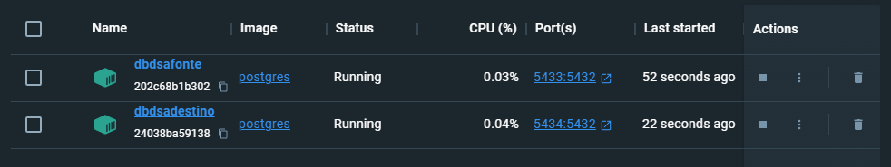

# Local Datawarehouse com Docker

## Sumário
- [Apresentação geral do projeto](#apresentação-geral-do-projeto)
- [Definição do problema de negócio](#definição-do-problema-de-negócio)
- [Esboço de modelagem](#esboço-de-modelagem)
    - [Modelagem dimensional](#modelagem-dimensional)
    - [Modelagem física](#modelagem-física)
- [Arquitetura do ETL](#arquitetura-do-etl)
- [Criação dos containers](#criação-dos-containers)

## Apresentação geral do projeto

Para este projeto vamos construir um DW para uma empresa fictícia. A empresa “TechFab Manufatura S.A”.

Uma empresa de manufatura é um tipo de empresa que transforma matérias-primas ou componentes em produtos acabados através do uso de processos industriais. Esse tipo de empresa é responsável por projetar, produzir, montar e testar produtos, tais como automóveis, eletrônicos, alimentos, roupas, máquinas e equipamentos.

As empresas de manufatura geralmente possuem fábricas ou instalações onde os processos produtivos ocorrem. Essas instalações podem envolver o uso de máquinas, equipamentos, ferramentas, robôs e mão-de-obra qualificada para criar produtos que atendam às especificações de qualidade e segurança.

As empresas de manufatura podem atender tanto ao mercado de consumo final quanto ao mercado empresarial, produzindo uma ampla variedade de produtos em diferentes setores. Algumas empresas de manufatura são especializadas em um único produto, enquanto outras produzem uma ampla gama de produtos em diferentes áreas.

A manufatura é uma das principais atividades econômicas em muitos países, empregando milhões de pessoas em todo o mundo. As empresas de manufatura desempenham um papel fundamental na economia, fornecendo produtos essenciais e criando empregos em várias áreas, desde a produção até a administração, vendas e marketing.

A TechFab precisa gerar relatórios para melhor compreensão dos seus processos de negócio. A TechFab tem os seguintes dados disponíveis:

- **Dados de produção**: informações sobre a produção de produtos, incluindo quantidades produzidas, tempo de produção, taxas de defeito, dados de qualidade e informações sobre matérias-primas e processos de fabricação.

- **Dados de vendas**: informações sobre as vendas de produtos, incluindo preços, quantidades vendidas, locais de venda e dados de clientes.

- **Dados de fornecedores**: informações sobre fornecedores de matérias-primas e outros insumos necessários para a produção de produtos.

- **Dados financeiros**: informações sobre as finanças da empresa, incluindo receita, despesas, lucro e fluxo de caixa.

Abaixo estão alguns relatórios que a empresa gostaria para entender melhor o desempenho dos negócios, a eficiência da produção e as necessidades do mercado:

- **Relatórios de vendas**: relatórios que fornecem informações sobre as vendas por região, produto, canal de vendas e período de tempo, permitindo a empresa identificar os produtos mais vendidos, as tendências de mercado e os canais de vendas mais eficazes.

- **Relatórios de estoque**: relatórios que mostram informações sobre os níveis de estoque de matérias-primas, produtos em processo e produtos acabados, permitindo que a empresa gerencie seu estoque de forma mais eficiente e reduza os custos de armazenamento.

- **Relatórios de produção**: relatórios que mostram informações sobre a eficiência da produção, incluindo o tempo de ciclo, taxa de defeito, utilização de máquinas e outros indicadores de desempenho, permitindo que a empresa identifique áreas de melhoria e aumente a eficiência da produção.

- **Relatórios de manutenção**: relatórios que fornecem informações sobre as atividades de manutenção da empresa, incluindo o tempo de inatividade, manutenção preventiva e corretiva, custos de manutenção e outros indicadores de desempenho, permitindo que a empresa gerencie seus ativos de forma mais eficiente.

- **Relatórios financeiros**: relatórios que mostram informações financeiras, como receita, despesas, margem de lucro, fluxo de caixa e outras métricas financeiras importantes, permitindo que a empresa avalie sua saúde financeira e tome decisões informadas.

- **Relatórios de qualidade**: relatórios que fornecem informações sobre a qualidade dos produtos, incluindo os dados de inspeção e teste, o índice de defeito e outros indicadores de qualidade, permitindo que a empresa identifique áreas de melhoria na qualidade e tome medidas corretivas.

Nosso trabalho agora é implementar um projeto de DW que atenda as necessidades da empresa. Vamos ao trabalho.

## Definição do problema de negócio

A TechFab Manufatura S.A., com sede em São Paulo-SP, é uma das maiores empresas do Brasil no segmento de manufatura e venda de eletrônicos, direto ao consumidor. A empresa possui diversas lojas em todo estado de São Paulo, além de Rio de Janeiro, Minas Gerais, Pernambuco, Bahia, Goiás e Santa Catarina. Em seu sétimo ano de operação, a empresa tem conseguido manter boas margens de lucro, com um crescimento anual de faturamento na ordem de 7,4%. O CEO decidiu que é hora de expandir as operações e precisa compreender melhor o cenário atualda empresa.

Depois de extensa pesquisa, o CEO e o board de diretores decidiram que uma solução de Business Intelligence, com métricas e KPIs referentes ao negócio da empresa seriam úteis para compreender erros/acertos na gestão até aqui e ajudar na definição da estratégia de crescimento para os próximos anos.

Foi criado então o projeto DSAVANTE, com o objetivo de fornecer uma solução de Business Intelligence corporativa. A área de TI da companhia já possui licenças de software de solução de BI para geração de relatórios, de um pacote de software adquirido com um fornecedor. As licenças nunca haviam sido usadas e os diretores determinaram que o software fosse usado, como forma de reduzir custo, uma vez que o pacote já havia sido pago.

Entretanto, a empresa não possui experiência em Data Warehouses e você foi contratado para oferecer a consultoria necessária na construção da solução. Você será responsável pela criação do Data Warehouse e das interfaces ETL. A administração e suporte de primeiro nível será de responsabilidade da equipe de TI da empresa.

Em sua primeira reunião, diversos diretores explicaram em linhas gerais como funciona a operação da empresa e registraram isso em ata. Abaixo o resultado desta reunião.

A TechFab Manufatura S.A. é uma empresa que produz e vende eletrônicos, especialmente equipamentos de informática em geral. A empresa trabalha com margens agressivas e embora o investimento em Marketing seja pequeno, ele é constante. São diversas lojas em todo Brasil e aproximadamente 700 funcionários.

Cada loja possui um estoque de diversos produtos eletrônicos, tais como desktops, notebooks, tablets e smartphones, que são os principais produtos da empresa, mas diversos outros produtos são vendidos, como TVs, sistemas de som, periféricos, entre outros. São aproximadamente 250 produtos, distribuídos em 15 categorias. Um armazém situado em Barueri-SP, mantém os produtos que chegam via importação ou de fábricas em São Paulo e Minas Gerais, onde eles são catalogados, recebem um selo RFID e então são despachados para as lojas em todo Brasil. Cada produto possui um código SKU único, além de detalhes que são armazenados no sistema de cadastro de produtos, tais como nome do produto, marca, dimensões e outras especificações técnicas.

Sempre que uma venda é registrada em um ponto de venda, uma das 23 lojas em todo Brasil, os vendedores são orientados a criar um cadastro sobre o cliente e solicitar uma autorização para o cliente receber futuras promoções e campanhas de Marketing. Nome, telefone, endereço e e-mail são obrigatórios no cadastro, mas outras informações podem ser solicitadas, principalmente no caso de vendas a prazo, como emprego atual, renda, tempo de residência e número de filhos.

A empresa possui também um cadastro de cada loja, que hoje está em planilha Excel. Lá estão o nome de cada loja (uma espécie de apelido que ajuda a identificar cada loja), o endereço, a região, cidade e estado. Cada loja tem um código. Essa planilha atualiza periodicamente o sistema de vendas da empresa, já que cada venda registrada é associada a uma loja. Todas as lojas vendem todos os produtos, mas as lojas mantêm estoques diferentes, como forma de reduzir custos com logística, ou seja, não despachar muitos produtos para as lojas que possuem um volume menor de vendas, o que poderia requerer possível movimentação posterior dos produtos para lojas com volume maior. Cada loja possui um CEP cadastrado cuidadosamente, pois a empresa implementa frequentemente algoritmos de otimização de logística usando análise em grafos. Eles compararam um novo sistema recentemente, depois que ouviram dizer que o sistema, que é baseado em Inteligência Artificial, poderia reduzir em até 25% os custos de combustível otimizando as rotas dos caminhões de entrega!

Em cada loja, os funcionários atendem os clientes no showroom, onde os produtos são expostos e também no telefone. Cada loja conta com alguns vendedores, pessoal de limpeza e supervisor, trabalhando em 2 turnos. A empresa pretende começar a vender online, mas ainda não há previsão. Todos os funcionários são cadastrados no sistema interno da empresa, com número de matrícula, dados pessoais e especialidade. Uma venda é sempre feita por um vendedor, pois a empresa paga comissão pelas vendas efetuadas e a matrícula do responsável pela venda fica atrelada a cada venda realizada.

O valor e a quantidade de cada venda estão presentes nos relatórios diários da empresa, que são usados para diferentes decisões durante a semana. Mas esses relatórios são manuais, criados normalmente no Excel, e frequentemente apresentam erros. Cada diretor regional precisa saber as vendas por região, para acompanhar o desempenho da sua loja e comparar com as demais regiões. A empresa faz muitas vendas de produtos como um único pacote ou combo, mas que são produtos diferentes. Por exemplo: um desktop pode ser vendido junto com um monitor, teclado e mouse. Embora seja um pacote, os produtos possuem SKUs diferentes, valores diferentes e contribuem de forma diferente quando um desconto é concedido. A empresa calcula o percentual de cada produto em uma venda de pacotes ou combos.

Os diretores acreditam que algumas categorias de produtos podem não ser lucrativas e gostariam de confirmar esta informação com o novo sistema de BI. Essa informação também será útil para definir as estratégias de expansão e quais novas categorias de produtos devem ser consideradas.

## Esboço de modelagem

### Modelagem dimensional


### Modelagem física

- Tabela Dimensão Cliente
```sql
CREATE TABLE `DIM_CLIENTE` (
 `SK_CLIENTE` INTEGER(20) NOT NULL,
 `NK_ID_CLIENTE` VARCHAR(20) NOT NULL,
 `NM_CLIENTE` VARCHAR(50) NOT NULL,
 `NM_CIDADE_CLIENTE` VARCHAR(50) NOT NULL,
 `BY_ACEITA_CAMPANHA` BINARY NOT NULL,
 `DESC_CEP` VARCHAR(10) NOT NULL,
 PRIMARY KEY (`SK_CLIENTE`)
);
```

- Tabela Dimensão Produto
```sql
CREATE TABLE `DIM_PRODUTO` (
 `SK_PRODUTO` INTEGER(20) NOT NULL,
 `NK_ID_PRODUTO` VARCHAR(20) NOT NULL,
 `DESC_SKU` VARCHAR(50) NOT NULL,
 `NM_PRODUTO` VARCHAR(50) NOT NULL,
 `NM_CATEGORIA_PRODUTO` VARCHAR(30) NOT NULL,
 `NM_MARCA_PRODUTO` VARCHAR(30) NOT NULL,
 PRIMARY KEY (`SK_PRODUTO`)
);
```

- Tabela Dimensão Localidade
```sql
CREATE TABLE `DIM_LOCALIDADE` (
 `SK_LOCALIDADE` INTEGER(20) NOT NULL,
 `NK_ID_LOCALIDADE` VARCHAR(20) NOT NULL,
 `NM_LOCALIDADE` VARCHAR(50) NOT NULL,
 `NM_CIDADE_LOCALIDADE` VARCHAR(50) NOT NULL,
 `NM_REGIAO_LOCALIDADE` VARCHAR(50) NOT NULL,
 PRIMARY KEY (`SK_LOCALIDADE`)
);
```

- Tabela Dimensão Tempo
```sql
CREATE TABLE `DIM_TEMPO` (
 `SK_DATA` INTEGER(20) NOT NULL,
 `DATA` DATE NOT NULL,
 `DESC_DATA_COMPLETA` VARCHAR(50) NOT NULL,
 `NR_ANO` INTEGER(4) NOT NULL,
 `NM_TRIMESTRE` VARCHAR(20) NOT NULL,
 `NR_MES` INTEGER NOT NULL,
 `NM_MES` VARCHAR(20) NOT NULL,
 `NR_SEMANA` INTEGER NOT NULL,
 `NM_ANO_SEMANA` VARCHAR(20) NOT NULL,
 `NR_DIA` INTEGER NOT NULL,
 `NM_DIA_SEMANA` VARCHAR (20) NOT NULL,
 `FLAG_FERIADO` CHAR(3) NOT NULL,
 `NM_FERIADO` VARCHAR(20) NOT NULL,
 PRIMARY KEY (`SK_DATA`)
);
```

- Tabela Fato de Vendas
```sql
CREATE TABLE `FATO_VENDA` (
 `SK_CLIENTE` INTEGER(20) NOT NULL,
 `SK_PRODUTO` INTEGER(20) NOT NULL,
 `SK_LOCALIDADE` INTEGER(20) NOT NULL,
 `SK_DATA` INTEGER(20) NOT NULL,
 `VL_VENDA` DECIMAL NOT NULL,
 `QTD_VENDA` INTEGER NOT NULL,
 PRIMARY KEY (`SK_CLIENTE`, `SK_PRODUTO`, `SK_LOCALIDADE`, `SK_DATA`)
);
```

## Arquitetura do ETL


- Extração de dados com Airbyte:
    - Os dados serão levados do servidor da Fonte de Dados para o servidor da Staging Area. Aqui não haverá filtro ou transformação e os dados brutos das tabelas correspondentes serão levados para a Staging Area. O objetivo é gerar a menor sobrecarga possível no servidor de origem dos dados.

- Transformação e Carga de Dados via SQL:
    - Na Staging Area os dados serão limpos, transformados e processados com linguagem SQL. A linguagem SQL também será usada para carregar os dados no DW (o que pode ser feito com uma query).

## Criação dos containers

Executaremos os comandos a seguir para a criação dos containers:

- Fonte de Dados
```bash
docker run --name dbdsafonte -p 5433:5432 -e POSTGRES_USER=dbadmin -e POSTGRES_PASSWORD=dbadmin123 -e POSTGRES_DB=postgresDB -d postgres
```

- Staging Area/DW
```bash
docker run --name dbdsadestino -p 5434:5432 -e POSTGRES_USER=dbadmin -e POSTGRES_PASSWORD=dbadmin123 -e POSTGRES_DB=postgresDB -d postgres
```

O resultado é a criação de dois containers de uma única imagem Postgres:


