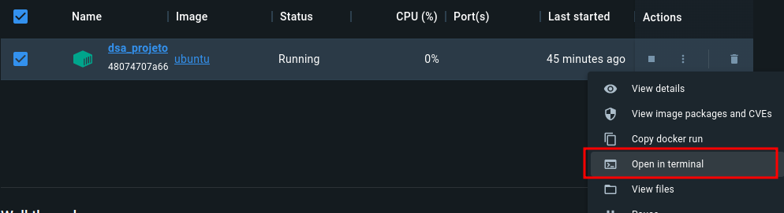
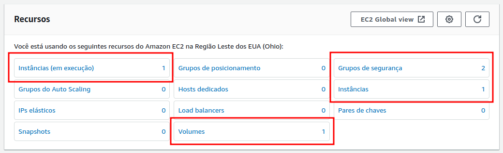
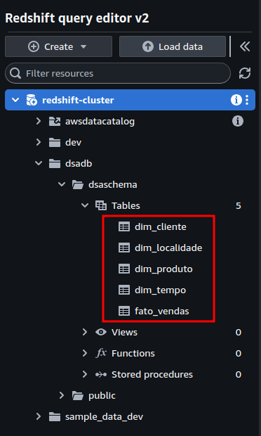
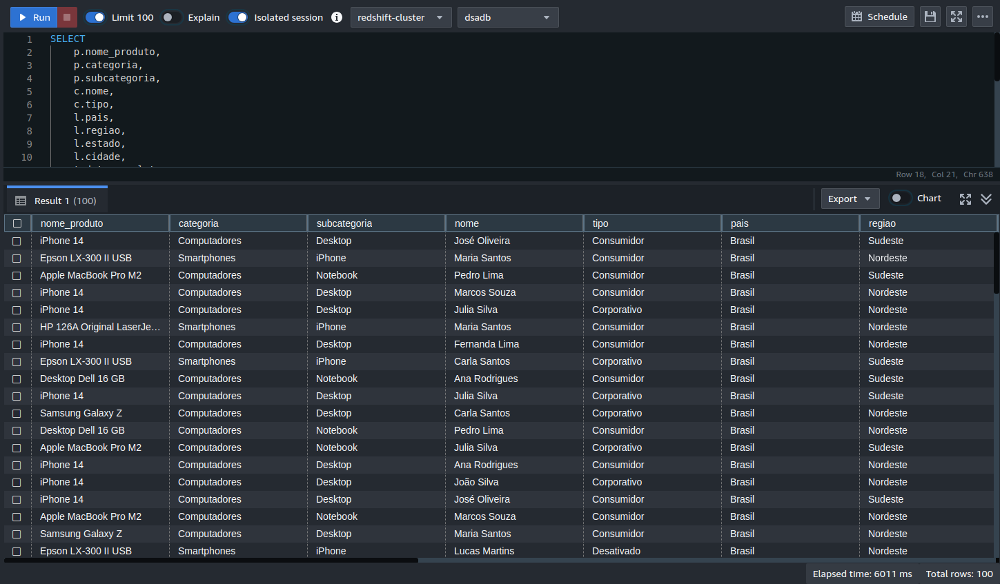

# Cloud Computing Data Warehouse com Terraform na AWS

## Sumário
- [Apresentação geral do projeto](#apresentação-geral-do-projeto)
- [Criação de conta na AWS e aquisição de chave de acesso via IAM](#criação-de-conta-na-aws-e-aquisição-de-chave-de-acesso-via-iam)
- [Instalação AWS CLI e Terraform via Docker](#instalação-aws-cli-e-terraform-via-docker)
  - [Criação do container e instalação de utilitários](#criação-do-container-e-instalação-de-utilitários)
  - [Instalação e configuração do AWS CLI](#instalação-e-configuração-do-aws-cli)
  - [Instalação do Terraform](#instalação-do-terraform)
- [Criação da nossa primeira infraestrutura como código (IaC)](#criação-da-nossa-primeira-infraestrutura-como-código-iac)
- [Criação do Data Warehouse em nuvem na AWS](#criação-do-data-warehouse-em-nuvem-na-aws)
  - [Criação do bucket S3 para dados](#criação-do-bucket-s3-para-dados)
  - [Criação e configuração de um container cliente](#criação-e-configuração-de-um-container-cliente)
  - [Criação da infraestrutura](#criação-da-infraestrutura)
  - [Realizando a carga de dados no Data Warehouse](#realizando-a-carga-de-dados-no-data-warehouse)

## Apresentação geral do projeto

O objetivo do Projeto 2 é implementar um Data Warehouse no ambiente em nuvem. 

Implementar um DW significa implementar a infraestrutura, implementar o modelo do DW e carregar os dados via ETL.
Mas  para  deixar  o  projeto  ainda  mais  profissional  faremos  a  implementação automatizando a etapa de configuração da infraestrutura usando IaC. Ao invés de realizar a implementação manualmente, toda a infraestrutura será criada via código, através do Terraform.

## Criação de conta na AWS e aquisição de chave de acesso via IAM

Para este projeto, utilizaremos a AWS como provedora Cloud, no seu nível gratuito (https://aws.amazon.com/pt/free/).

Após o processo de criação de conta, vamos logar e gerar as chave de acesso a partir do **IAM** (Identity and Access Management).

Selecionando a opção de exportação em `.csv`, teremos um arquivo com o seguinte padrão:
```
Access key ID,Secret access key
xxxxxxxx,xxxxxxxxxx
```

Utilizaremos este arquivo para autenticar o Terraform.

## Instalação AWS CLI e Terraform via Docker

Para interagir com a AWS, utilizaremos o AWS CLI (https://aws.amazon.com/pt/cli/), uma interface de linha de comando para gerenciamento dos serviços de nuvem.

Criaremos um container Docker para instalação do AWS CLI e do Terraform, seguindo os passos abaixo.
Todos os comandos podem ser encontrados [neste arquivo .txt](./config/configuracao_container.txt).

### Criação do container e instalação de utilitários

```docker
$ docker run -dti --name dsa_projeto2 --rm ubuntu
```

Com o comando executado, o container Docker está criado e pronto para ser utilizado.

Acessaremos o terminal do container desta forma:



Agora que estamos dentro do terminal, executaremos os seguintes comandos para atualização e instalação dos utilitários que vamos precisar.

```bash
# Entra em modo bash interativo
$ bash

# Instala utilitários
$ apt-get update
$ apt-get upgrade
$ apt-get install curl nano wget unzip

# Cria pasta de Downloads e entra nela
$ mkdir Downloads
$ cd Downloads
```

### Instalação e configuração do AWS CLI

Vamos baixar os arquivos do AWS CLI com o comando abaixo:

```bash
$ curl "https://awscli.amazonaws.com/awscli-exe-linux-x86_64.zip" -o "awscliv2.zip"
```

Após a finalização do download, nós precisamos descompactar e instalar o programa:

```bash
# Descompacta o arquivo
$ unzip awscliv2.zip

# Executa a instalação
$ ./aws/install
```

Para iniciar a configuração, executamos o seguinte comando:

```bash
$ aws configure
```

O comando de configuração pedir que você preencha alguns informações. Preencha da seguinte forma:

```
Access key ID: <utilizar aqui a chave de acesso>
Secret access key: <utilizar aqui a chave de acesso>
Default region name: us-east-2
Default output format: <deixe em branco e pressione enter>
```

Com o comando executado, podemos testar se a autenticação deu certo, ao tentar listar nossos buckets no Amazon S3:

```bash
$ aws s3 ls
```

Caso não haja erros, significa que nós conseguimos autenticar!


### Instalação do Terraform

Ainda no terminal do container, vamos executar os seguintes comandos para instalar o Terraform:

```bash
# Instala o pacote para autenticação da chave
$ apt-get update && apt-get install -y gnupg software-properties-common

# Faz download da chave
$ wget -O- https://apt.releases.hashicorp.com/gpg | gpg --dearmor | tee /usr/share/keyrings/hashicorp-archive-keyring.gpg

# Ativa aa chave e inclui o repositório
$ echo "deb [signed-by=/usr/share/keyrings/hashicorp-archive-keyring.gpg] https://apt.releases.hashicorp.com $(lsb_release -cs) main" | tee /etc/apt/sources.list.d/hashicorp.list

# Instala o Terraform
$ apt update && apt-get install terraform

# Verifica a instalação
$ terraform --version
```

## Criação da nossa primeira infraestrutura como código (IaC)

Para testar a instalação do Terraform, criaremos uma máquina virtual na AWS via código. 

É necessário transferir o arquivo abaixo no container Docker.

Utilizaremos o arquivo `main.tf`, disponível [aqui](./config/terraform/aws-hcl/main.tf), com a seguinte estrutura:

```terraform
provider "aws" {
  region = "us-east-2"
}

resource "aws_security_group" "allow_http_ssh" {
  name        = "allow_http_ssh"
  description = "Allow HTTP and SSH traffic"

  ingress {
    from_port   = 22
    to_port     = 22
    protocol    = "tcp"
    cidr_blocks = ["0.0.0.0/0"]
  }

  ingress {
    from_port   = 80
    to_port     = 80
    protocol    = "tcp"
    cidr_blocks = ["0.0.0.0/0"]
  }

  egress {
    from_port   = 0
    to_port     = 0
    protocol    = "-1"
    cidr_blocks = ["0.0.0.0/0"]
  }
}

resource "aws_instance" "web_server" {
  ami           = "ami-0c55b159cbfafe1f0" # Amazon Linux 2 AMI ID
  instance_type = "t2.micro"

  vpc_security_group_ids = [aws_security_group.allow_http_ssh.id]

  tags = {
    Name = "Web Server"
  }
}
```

Executaremos os comandos abaixo para providenciar a criação da infraestrutura:

```bash
# Entrando na pasta que contém o arquivo .tf
$ cd aws-hcl

# Inicializando a operação do Terraform
$ terraform init

# Executando a criação da infraestrutura
$ terraform apply
```

A imagem abaixo, retirada do console da AWS, comprova que a criação deu certo:



Para deletar a infraestrutura criada anteriormente, executaremos o seguinte comando:

```bash
# Deletando a infraestrutura criada
$ terraform destroy
```

## Criação do Data Warehouse em nuvem na AWS

### Criação do bucket S3 para dados

Com o terminal autenticado com as credenciais da AWS, executaremos o comando abaixo para criar um bucket no S3:

```bash
$ aws s3 mb s3://dsa-dw-projeto2
```

Listando os buckets disponíveis, para confirmar a criação solicitada no comando anterior:

```bash
$ aws s3 ls
2024-01-27 00:30:28 dsa-dw-projeto2
```

Após a criação do bucket, vamos transferir os arquivos contendo os dados iniciais ([disponíveis aqui](./dados/)) para dentro de uma pasta no bucket:

``` bash
$ aws s3 cp ./dados/ s3://dsa-dw-projeto2/dados --recursive
```

Listando os arquivos de dentro da pasta do bucket para confirmar a operação realizada anteriormente:

```bash
$ aws s3 ls s3://dsa-dw-projeto2/dados --recursive
2024-01-27 00:45:37        286 dados/dim_cliente.csv
2024-01-27 00:45:37        404 dados/dim_localidade.csv
2024-01-27 00:45:37        274 dados/dim_produto.csv
2024-01-27 00:45:37      46315 dados/dim_tempo.csv
2024-01-27 00:45:37      30717 dados/fato_vendas.csv
```

### Criação e configuração de um container cliente

Para criação e configuração de um container cliente, vamos seguir os passos listados em [Instalação AWS CLI e Terraform via Docker](#instalação-aws-cli-e-terraform-via-docker), mas com uma pequena modificação.

Ao invés de criarmos um container com a imagem pura do Ubuntu, criaremos com base numa imagem do Postgres (que já usa a base do Ubuntu), conforme abaixo:

```docker
$ docker run --name cliente_dsa -p 5438:5432 -e POSTGRES_USER=dsadmin -e POSTGRES_PASSWORD=dsadmin123 -e POSTGRES_DB=dsdb -d postgres
```

### Criação da infraestrutura

Para criar a infraestrutura como código (IaC), precisamos que os arquivos com extensão `.tf` [disponíveis aqui](./config/terraform/redshift-dw/) estejam presentes dentro do container cliente, conforme abaixo:

```bash
# Acessando a pasta 
$ cd redshift-dw

# Listando os arquivos presentes
$ ls
provider.tf  redshift_role.tf  redshift.tf

# Inicializando a operação do Terraform
$ terraform init

# Executando a criação da infraestrutura
$ terraform apply
```

Para validar a criação solicitada pelos comandos anteriores, podemos listar os clusters Redshift em execução na nossa conta:

```bash
$ aws redshift describe-clusters

{
    "Clusters": [
        {
            "ClusterIdentifier": "redshift-cluster",
            "NodeType": "dc2.large",
            "ClusterStatus": "available",
            "ClusterAvailabilityStatus": "Unavailable",
            "MasterUsername": "adminuser",
            "DBName": "dsadb",
            "Endpoint": {
                "Address": "redshift-cluster.ceocz8l0ucs6.us-east-2.redshift.amazonaws.com",
                "Port": 5439
            },
...
```

### Realizando a carga de dados no Data Warehouse

Nesta etapa, precisamos de algumas informaçẽos específicas para que o script de criação e carga das tabelas dentro do Date Warehouse execute corretamente.

É importante notar que essas informações podem variar, e que as listadas abaixo são de acordo com o projeto em questão.

- Caminho da pasta com os dados dentro do Bucket S3:
  - `s3://dsa-dw-projeto2/dados`

- ARN (Amazon Resource Name) do IAM Role criado anteriormente:
  - `arn:aws:iam::654654230256:role/RedshiftS3AccessRole`

- Endpoint do cluster Redshift:
  - `redshift-cluster.ceocz8l0ucs6.us-east-2.redshift.amazonaws.com`

Com essas informações coletadas, o arquivo `.sql` [disponível aqui](./dados/load_data.sql) estará de acordo com o nosso projeto, e deverá constar dentro do container cliente:

```sql
CREATE SCHEMA IF NOT EXISTS dsaschema;

CREATE TABLE IF NOT EXISTS dsaschema.dim_cliente 
(
    sk_cliente integer NOT NULL,
    id_cliente integer NOT NULL,
    nome character varying(50) NOT NULL,
    tipo character varying(50),
    CONSTRAINT dim_cliente_pkey PRIMARY KEY (sk_cliente)
);

CREATE TABLE IF NOT EXISTS dsaschema.dim_localidade
(
    sk_localidade integer NOT NULL,
    id_localidade integer NOT NULL,
    pais character varying(50) NOT NULL,
    regiao character varying(50) NOT NULL,
    estado character varying(50) NOT NULL,
    cidade character varying(50) NOT NULL,
    CONSTRAINT dim_localidade_pkey PRIMARY KEY (sk_localidade)
);

CREATE TABLE IF NOT EXISTS dsaschema.dim_produto
(
    sk_produto integer NOT NULL,
    id_produto integer NOT NULL,
    nome_produto character varying(50) NOT NULL,
    categoria character varying(50) NOT NULL,
    subcategoria character varying(50) NOT NULL,
    CONSTRAINT dim_produto_pkey PRIMARY KEY (sk_produto)
);

CREATE TABLE IF NOT EXISTS dsaschema.dim_tempo
(
    sk_tempo integer NOT NULL,
    data_completa date,
    ano integer NOT NULL,
    mes integer NOT NULL,
    dia integer NOT NULL,
    CONSTRAINT dim_tempo_pkey PRIMARY KEY (sk_tempo)
);

CREATE TABLE IF NOT EXISTS dsaschema.fato_vendas
(
    sk_produto integer NOT NULL,
    sk_cliente integer NOT NULL,
    sk_localidade integer NOT NULL,
    sk_tempo integer NOT NULL,
    quantidade integer NOT NULL,
    preco_venda numeric(10,2) NOT NULL,
    custo_produto numeric(10,2) NOT NULL,
    receita_vendas numeric(10,2) NOT NULL,
    CONSTRAINT fato_vendas_pkey PRIMARY KEY (sk_produto, sk_cliente, sk_localidade, sk_tempo),
    CONSTRAINT fato_vendas_sk_cliente_fkey FOREIGN KEY (sk_cliente) REFERENCES dsaschema.dim_cliente (sk_cliente),
    CONSTRAINT fato_vendas_sk_localidade_fkey FOREIGN KEY (sk_localidade) REFERENCES dsaschema.dim_localidade (sk_localidade),
    CONSTRAINT fato_vendas_sk_produto_fkey FOREIGN KEY (sk_produto) REFERENCES dsaschema.dim_produto (sk_produto),
    CONSTRAINT fato_vendas_sk_tempo_fkey FOREIGN KEY (sk_tempo) REFERENCES dsaschema.dim_tempo (sk_tempo)
);

COPY dsaschema.dim_cliente
FROM 's3://dsa-dw-projeto2/dados/dim_cliente.csv'
IAM_ROLE 'arn:aws:iam::654654230256:role/RedshiftS3AccessRole'
CSV;

COPY dsaschema.dim_localidade
FROM 's3://dsa-dw-projeto2/dados/dim_localidade.csv'
IAM_ROLE 'arn:aws:iam::654654230256:role/RedshiftS3AccessRole'
CSV;

COPY dsaschema.dim_produto
FROM 's3://dsa-dw-projeto2/dados/dim_produto.csv'
IAM_ROLE 'arn:aws:iam::654654230256:role/RedshiftS3AccessRole'
CSV;

COPY dsaschema.dim_tempo
FROM 's3://dsa-dw-projeto2/dados/dim_tempo.csv'
IAM_ROLE 'arn:aws:iam::654654230256:role/RedshiftS3AccessRole'
CSV;

COPY dsaschema.fato_vendas
FROM 's3://dsa-dw-projeto2/dados/fato_vendas.csv'
IAM_ROLE 'arn:aws:iam::654654230256:role/RedshiftS3AccessRole'
CSV;
```

Para finalizar, realizaremos a carga dos dados usando os comandos abaixo, executados dentro do container cliente:

```bash
# Acessando a pasta que contém o script de ingestão
$ cd dados

# Executando o script
$ psql -h redshift-cluster.ceocz8l0ucs6.us-east-2.redshift.amazonaws.com -U adminuser -d dsadb -p 5439 -f load_data.sql
Password for user adminuser:

# Inserindo a senha 
$ dsaS9curePassw2rd
CREATE SCHEMA
CREATE TABLE
CREATE TABLE
CREATE TABLE
CREATE TABLE
CREATE TABLE
psql:load_data.sql:63: INFO:  Load into table 'dim_cliente' completed, 10 record(s) loaded successfully.
COPY
psql:load_data.sql:68: INFO:  Load into table 'dim_localidade' completed, 10 record(s) loaded successfully.
COPY
psql:load_data.sql:73: INFO:  Load into table 'dim_produto' completed, 6 record(s) loaded successfully.
COPY
psql:load_data.sql:78: INFO:  Load into table 'dim_tempo' completed, 1827 record(s) loaded successfully.
COPY
psql:load_data.sql:83: INFO:  Load into table 'fato_vendas' completed, 995 record(s) loaded successfully.
COPY
```

Como resultado dos comandos de criação e ingestão, temos a estrutura de tabelas constando no Redshift:



Para verificar a ingestão, executaremos a consulta a seguir, que traz como resposta os dados conforme esperado:

```sql
SELECT 
    p.nome_produto,
    p.categoria,
    p.subcategoria,
    c.nome,
    c.tipo,
    l.pais,
    l.regiao,
    l.estado,
    l.cidade,
    t.data_completa,
    t.ano,
    t.mes,
    t.dia,
    f.quantidade,
    f.preco_venda,
    f.custo_produto,
    f.receita_vendas
FROM
    dsaschema.fato_vendas AS f
    INNER JOIN dsaschema.dim_produto AS p
        ON f.sk_produto = p.sk_produto
    INNER JOIN dsaschema.dim_cliente AS c
        ON f.sk_cliente = c.sk_cliente
    INNER JOIN dsaschema.dim_localidade AS l
        ON f.sk_localidade = l.sk_localidade
    INNER JOIN dsaschema.dim_tempo AS t
        ON f.sk_tempo = t.sk_tempo
```

